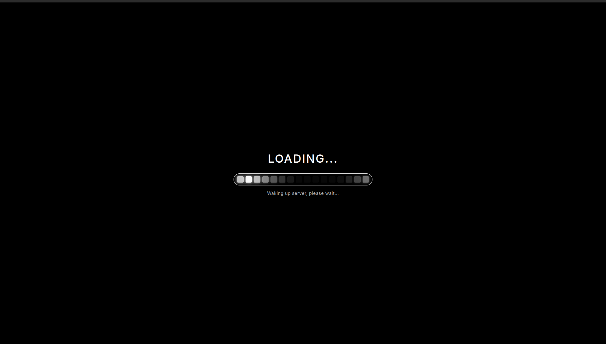
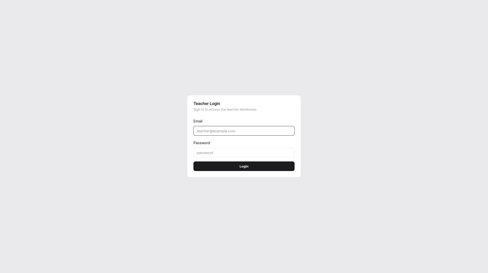
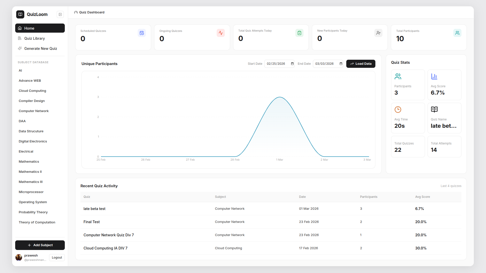
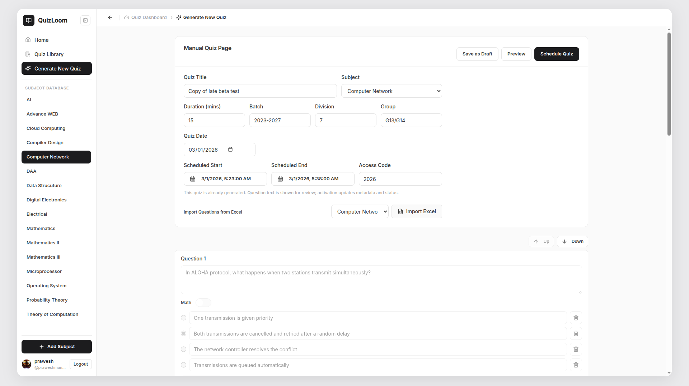

# QuizLoom

A full-stack QuizLoom platform for teachers and students, with quiz authoring, scheduling, live monitoring, response analytics, proctoring flags, and Excel import/export workflows.

---

## Previews

<table>
  <tr>
    <td></td>
    <td></td>
  </tr>
  <tr>
    <td></td>
    <td></td>
  </tr>
</table>

---

## Features

### Teacher Features
- Secure teacher authentication (login/profile/password update/logout).
- Create and manage subjects and units.
- Build quizzes manually or auto-generate from unit question pools.
- Import questions from Excel and manage question bank entries.
- Save quizzes as draft, schedule activation windows, and share quiz links/access codes.
- Track scheduled and ongoing quizzes from dedicated list views.
- Monitor live quiz stats and participant responses in real time.
- View response details, violation timelines, and leaderboard rankings.
- Export quiz results as `.xlsx`.

### Student Features
- Join quizzes using access token + access code flow.
- Attempt timed quizzes with autosave progress.
- Submit manually or auto-submit on timer/session end.
- Get score summary with percentage and breakdown after submission.
- Proctoring-aware attempt flow (tab switch/copy/context events reported as violations).

---

## Project Structure

```text
quizloom/
|-- client/        # React + Vite frontend (teacher and student UI)
|-- server/        # Express API + business logic + PostgreSQL integration
|-- public/        # README preview screenshots/assets
|-- structure.md   # Complete architecture and endpoint documentation
|-- README.md
`-- LICENSE
```

---

## Tech Stack

<table>
  <thead>
    <tr>
      <th>Layer</th>
      <th>Technology</th>
      <th>Used In</th>
      <th>Purpose</th>
    </tr>
  </thead>
  <tbody>
    <tr>
      <td>Frontend</td>
      <td>React 18</td>
      <td><code>client/src</code></td>
      <td>Component-based UI for teacher and student experiences.</td>
    </tr>
    <tr>
      <td>Frontend</td>
      <td>Vite</td>
      <td><code>client/vite.config.js</code>, client build/dev scripts</td>
      <td>Fast dev server and optimized production bundling.</td>
    </tr>
    <tr>
      <td>Frontend</td>
      <td>React Router DOM</td>
      <td><code>client/src/App.jsx</code></td>
      <td>Routing for auth, student quiz flow, and protected teacher pages.</td>
    </tr>
    <tr>
      <td>Frontend</td>
      <td>TanStack React Query</td>
      <td>Teacher and student pages, API-bound data flows</td>
      <td>Server-state caching, query lifecycle management, and mutation invalidation.</td>
    </tr>
    <tr>
      <td>Frontend</td>
      <td>Tailwind CSS + Radix UI</td>
      <td><code>client/src/components/ui</code>, <code>client/src/index.css</code></td>
      <td>Design system primitives and utility-first styling.</td>
    </tr>
    <tr>
      <td>Frontend</td>
      <td>Axios</td>
      <td><code>client/src/services/api.js</code></td>
      <td>HTTP client with auth header injection and global error toast interceptor.</td>
    </tr>
    <tr>
      <td>Frontend</td>
      <td>Recharts</td>
      <td><code>client/src/components/teacher/ParticipantsTrendChart.jsx</code></td>
      <td>Dashboard analytics visualization (participants trend charts).</td>
    </tr>
    <tr>
      <td>Frontend</td>
      <td>Zod</td>
      <td>Frontend input/schema validation points</td>
      <td>Runtime-safe validation for structured payload handling.</td>
    </tr>
    <tr>
      <td>Frontend</td>
      <td>XLSX</td>
      <td><code>client/src/utils/excelParser.js</code></td>
      <td>Client-side parsing and validation of question import spreadsheets.</td>
    </tr>
    <tr>
      <td>Backend</td>
      <td>Node.js + Express</td>
      <td><code>server/app.js</code>, <code>server/routes</code>, <code>server/controllers</code></td>
      <td>REST API, middleware pipeline, and request handling.</td>
    </tr>
    <tr>
      <td>Backend</td>
      <td>PostgreSQL + <code>pg</code></td>
      <td><code>server/config/db.js</code>, <code>server/sql/schema.sql</code></td>
      <td>Relational data storage for users, quizzes, sessions, and responses.</td>
    </tr>
    <tr>
      <td>Backend</td>
      <td><code>jsonwebtoken</code></td>
      <td><code>server/controllers/auth.controller.js</code>, <code>server/middleware/authenticate.js</code></td>
      <td>Teacher authentication using signed JWT access tokens.</td>
    </tr>
    <tr>
      <td>Backend</td>
      <td><code>bcryptjs</code></td>
      <td><code>server/controllers/auth.controller.js</code></td>
      <td>Password hashing and credential verification.</td>
    </tr>
    <tr>
      <td>Backend</td>
      <td><code>exceljs</code></td>
      <td><code>server/controllers/quizzes.controller.js</code></td>
      <td>Generate downloadable quiz response exports in <code>.xlsx</code> format.</td>
    </tr>
    <tr>
      <td>Backend</td>
      <td>Zod</td>
      <td><code>server/middleware/validate.js</code> + controller schemas</td>
      <td>Request body/query validation and consistent API error shaping.</td>
    </tr>
    <tr>
      <td>Tooling</td>
      <td><code>concurrently</code></td>
      <td>Root <code>package.json</code> scripts</td>
      <td>Run client and server processes together in local development/start flows.</td>
    </tr>
    <tr>
      <td>Tooling</td>
      <td><code>nodemon</code></td>
      <td><code>server/package.json</code> (<code>npm run dev</code>)</td>
      <td>Auto-restart backend during development on file changes.</td>
    </tr>
  </tbody>
</table>

---

## How To Run

### Prerequisites
- Node.js 20+
- npm 10+
- PostgreSQL 14+

### 1. Clone and install dependencies

```bash
git clone <your-repo-url>
cd quizloom
npm run install:all
```

### 2. Configure environment variables

```bash
cp server/.env.example server/.env
cp client/.env.example client/.env
```

Update `server/.env` with at least:
- `DATABASE_URL`
- `JWT_SECRET`
- `CLIENT_URL`

### 3. Initialize database schema

```bash
cd server
psql "$DATABASE_URL" -f sql/schema.sql
cd ..
```

### 4. Run in development mode

```bash
npm run dev
```

Default URLs:
- Frontend: `http://localhost:5173`
- Backend: `http://localhost:5000`

### 5. Build / run production mode

```bash
npm run build
npm run start
```

---

## Detailed Documentation

For complete project documentation, refer to:

- [`structure.md`](./structure.md): full architecture, routes, APIs, auth flow, DB mapping, and lifecycle details.

---

## License

MIT — see [`LICENSE`](./LICENSE)

---
