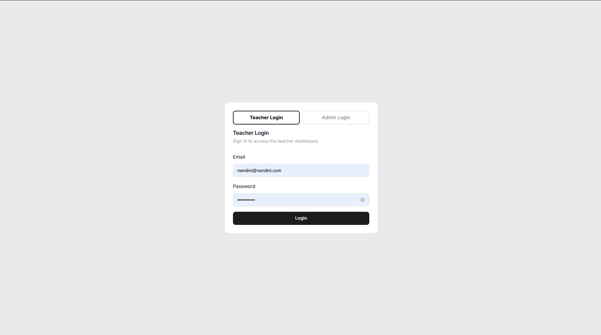
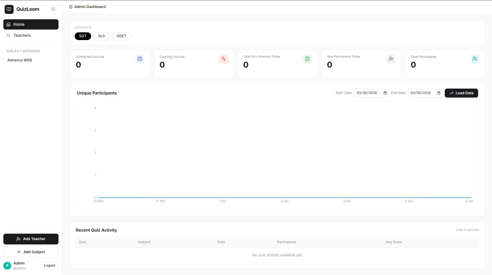
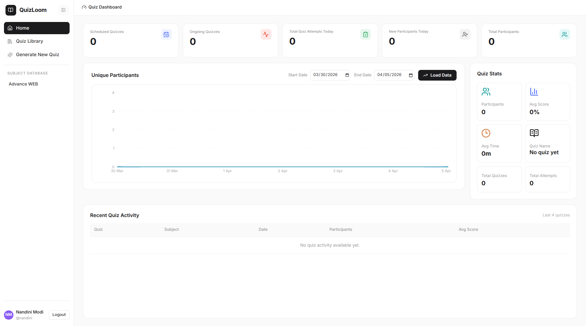

# QuizLoom

QuizLoom is a full-stack quiz platform for teachers, students, and administrators. It supports quiz authoring, scheduled activation, live monitoring, response analytics, proctoring flags, and Excel import/export workflows.

---

## Previews

<table>
  <tr>
    <td></td>
    <td></td>
  </tr>
  <tr>
    <td></td>
    <td></td>
  </tr>
</table>

---

## Features

### Teacher

- Secure auth, profile updates, password changes, and avatar upload/removal.
- Subject/unit/question bank management (including Excel bulk import).
- Manual and auto-generated quiz creation.
- Draft, scheduled, active, and ended quiz lifecycle management.
- Live quiz insights, response review, violations timeline, leaderboard, and XLSX exports.

### Student

- Enter quiz via access token + access code.
- Timed attempt with autosave progress.
- Manual submit or automatic submit when session/quiz ends.
- Score summary with percentage and scored points.
- Proctoring-aware flow (tab switch, copy/paste, context menu events).

### Admin

- Environment-backed admin authentication.
- Dashboard access and teacher management views.
- School-wise teacher listing and subject assignment workflows.
- Global teacher operations: list all teachers, remove school assignment, and delete teacher.

---

## Project Structure

```text
quiz-platform/
- client/          # React + Vite frontend
- server/          # Express API + PostgreSQL backend
- public/          
- package.json     
- package-lock.json
- structure.md     # full architecture and endpoint reference
- README.md
```

---

## Tech Stack

<table>
  <thead>
    <tr>
      <th>Layer</th>
      <th>Technology</th>
      <th>Purpose</th>
    </tr>
  </thead>
  <tbody>
    <tr>
      <td>Frontend</td>
      <td>React 18, Vite, React Router DOM</td>
      <td>SPA routing and page rendering</td>
    </tr>
    <tr>
      <td>Frontend</td>
      <td>TanStack React Query, Axios</td>
      <td>API data fetching, caching, mutations</td>
    </tr>
    <tr>
      <td>Frontend</td>
      <td>Tailwind CSS, Radix UI, React Hook Form, Zod</td>
      <td>UI system and validation</td>
    </tr>
    <tr>
      <td>Frontend</td>
      <td>Recharts, XLSX</td>
      <td>Charts and spreadsheet workflows</td>
    </tr>
    <tr>
      <td>Backend</td>
      <td>Node.js, Express</td>
      <td>REST API and middleware pipeline</td>
    </tr>
    <tr>
      <td>Backend</td>
      <td>PostgreSQL (<code>pg</code>)</td>
      <td>Primary relational data store</td>
    </tr>
    <tr>
      <td>Backend</td>
      <td><code>jsonwebtoken</code>, <code>bcryptjs</code></td>
      <td>JWT auth and password hashing</td>
    </tr>
    <tr>
      <td>Backend</td>
      <td><code>exceljs</code>, <code>multer</code>, Zod</td>
      <td>Export generation, avatar upload, request validation</td>
    </tr>
    <tr>
      <td>Tooling</td>
      <td><code>concurrently</code>, <code>nodemon</code></td>
      <td>Local multi-process dev and server reload</td>
    </tr>
  </tbody>
</table>

---

## Getting Started

### Prerequisites

- Node.js 20+
- npm 10+
- PostgreSQL 14+

### 1. Clone and install

```bash
git clone https://github.com/prawesh-12/quiz-platform.git
cd quiz-platform
npm run install:all
```

### 2. Configure environment variables

```bash
cp server/.env.example server/.env
cp client/.env.example client/.env
```

Update `server/.env`:

- Required: `DATABASE_URL`, `JWT_SECRET`, `ADMIN_EMAIL`, `ADMIN_PASSWORD_HASH`
- Recommended: `ADMIN_NAME`, `JWT_EXPIRES_IN`, `CLIENT_URLS`, `PORT`, `NODE_ENV`

Update `client/.env`:

- `VITE_API_URL` (typically `http://localhost:5000` in local dev)

### 3. Initialize schema

```bash
cd server
psql "$DATABASE_URL" -f sql/schema.sql
cd ..
```

Optional manual migration commands:

```bash
npm run migrate-plan1 --prefix server
npm run migrate-plan14-avatar --prefix server
node server/scripts/migrate_scheduled_status.js
```

### 4. Run development mode

```bash
npm run dev
```

Default dev URLs:

- Frontend: `http://localhost:5173`
- Backend: `http://localhost:5000`

### 5. Build and run production mode

```bash
npm run build
npm run start
```

Notes:

- `npm run build` builds the frontend (`client`) only.
- `npm run start` runs `server` + `client` preview concurrently.

---

## Auth and Token Model

- Teacher and admin APIs use Bearer JWT (`Authorization: Bearer <token>`).
- Student progress/submit and violation reporting use `X-Session-Token`.
- Quiz entry uses `access_token` + `access_code`.

---

## Detailed Documentation

For complete architecture, routes, API mappings, auth model, and DB details:

- [`structure.md`](./structure.md)

---

## License

MIT - see [`LICENSE`](./LICENSE)

---
