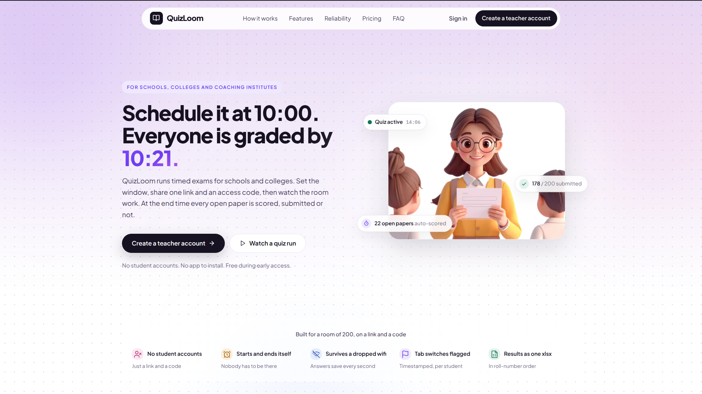
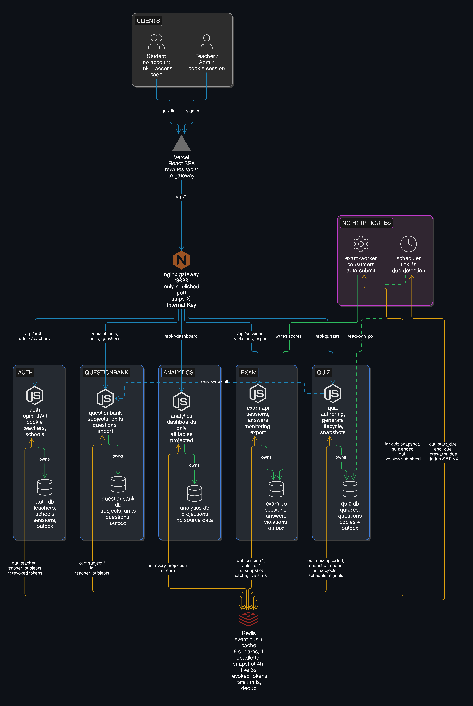
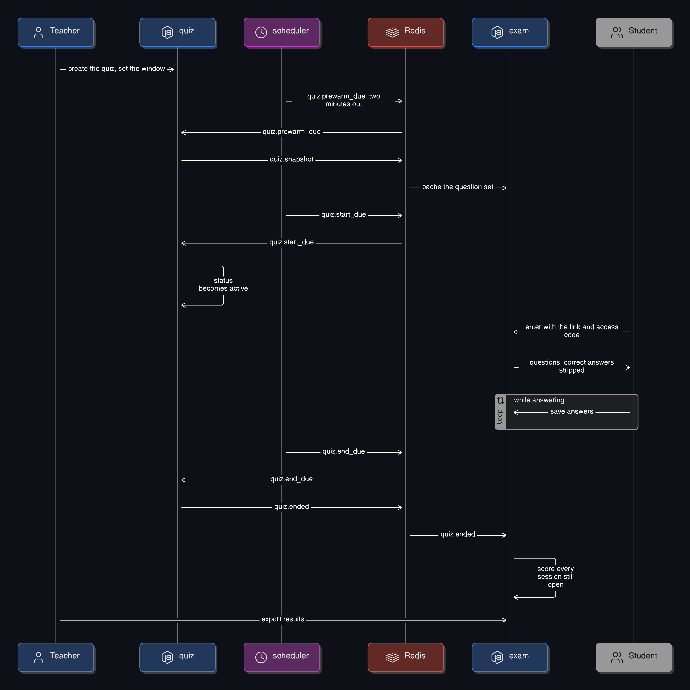
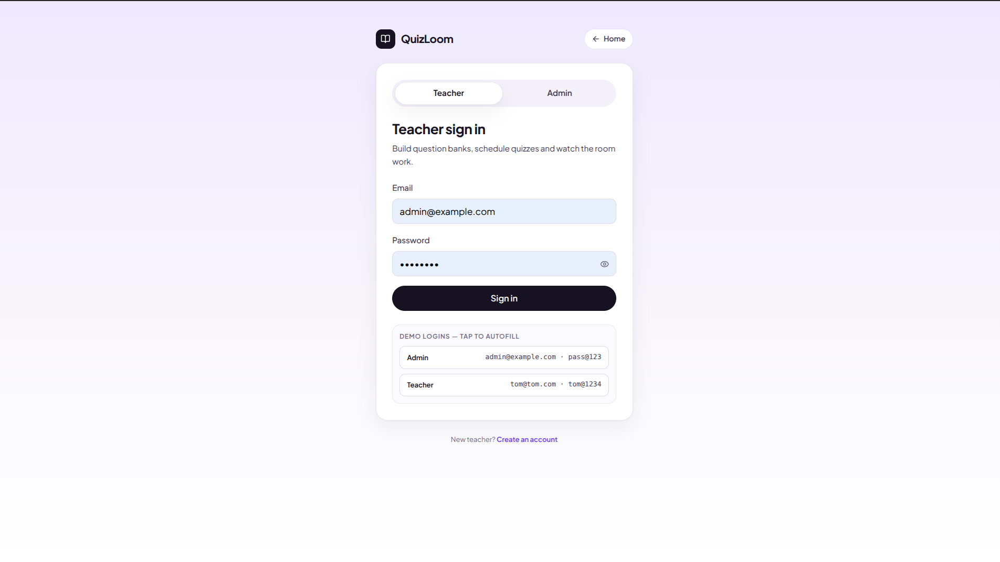
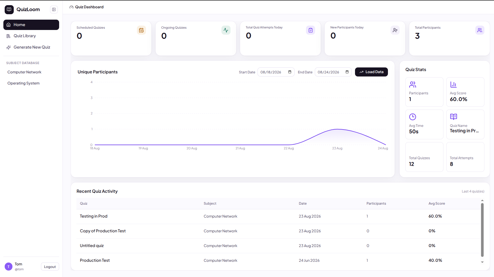
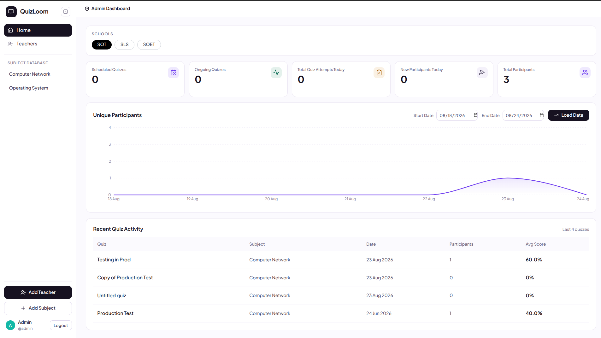
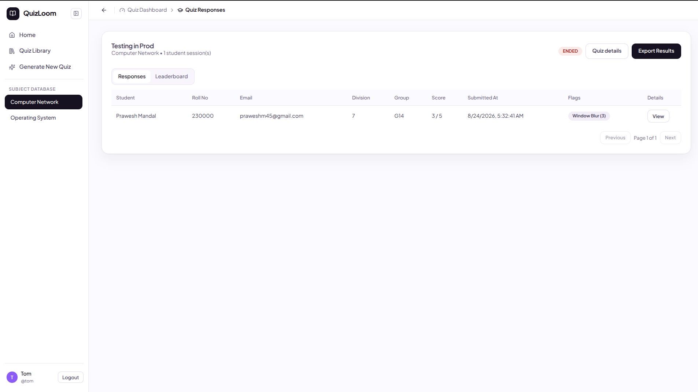
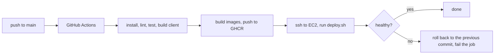

<div align="center">

<h1>
  
  QuizLoom
</h1>

A platform for conducting scheduled online examinations, from quiz creation and student access to live monitoring and automatic evaluation.

Built as an event-driven microservices system.

Teachers create a quiz, define its schedule, and share a single access link. Students join without creating an account, complete the exam, and have their answers saved while they work.

**Every student is graded when the quiz closes, whether or not they pressed Submit.**



</div>

---

## Table of Contents

- [Features](#features)
- [Architecture](#architecture)
  - [One quiz, start to finish](#one-quiz-start-to-finish)
- [Screenshots](#screenshots)
- [Tech stack](#tech-stack)
- [What problem it solves](#what-problem-it-solves)
- [Project structure](#project-structure)
- [Getting started](#getting-started)
- [Environment variables](#environment-variables)
- [Documentation](#documentation)
- [Testing](#testing)
- [Production deployment](#production-deployment)
- [Design decisions](#design-decisions)
- [Future improvements](#future-improvements)
- [License](#license)

---

## Features

| Feature                | What it does                                                                 |
| ---------------------- | ---------------------------------------------------------------------------- |
| Question bank          | Subjects, units, and reusable questions per unit                             |
| Excel import           | Upload a spreadsheet of questions into a subject                             |
| Auto-generated quizzes | Pick N random bank questions per unit                                        |
| Scheduled quizzes      | Set a start and end time; the quiz opens and closes on its own               |
| Student entry          | A link and an access code. No account                                        |
| Autosave               | Answers are saved while the student works                                    |
| Auto-submit            | When the quiz ends, open sessions are scored from saved answers              |
| Proctoring flags       | Tab switches, copy attempts, and right clicks are recorded per session       |
| Live monitoring        | Who has entered, submitted, is still working, or is flagged                  |
| Results                | Leaderboard, per-student responses, and an XLSX export sorted by roll number |
| Dashboards             | Quiz counts, participants, and average scores for teachers and admins        |

---

## Architecture

Six microservices behind an nginx gateway. Five own a PostgreSQL database; the scheduler owns none and reads the quiz database. The SPA is on Vercel and is deployed separately.

| Component    | Runs as                       | Owns                                                |
| ------------ | ----------------------------- | --------------------------------------------------- |
| gateway      | nginx container, port 8080    | Routes`/api/*`, strips inbound `X-Internal-Key` |
| auth         | container                     | Teachers, sessions, avatars                         |
| questionbank | container                     | Subjects, units, questions                          |
| quiz         | container                     | Quizzes, their questions, the status lifecycle      |
| exam         | container                     | Student sessions, answers, violations               |
| exam-worker  | same image,`node worker.js` | Event consumers, auto-submit                        |
| scheduler    | container, no HTTP            | Nothing. Reads the quiz database                    |
| analytics    | container                     | Dashboard read-models, rebuilt from events          |
| redis        | container                     | Event streams, snapshot cache, token denylist       |
| client       | Vercel                        | The SPA                                             |



Services publish events to Redis Streams instead of calling each other. Each writes the event into an outbox table in the same transaction as the data change, and a relay pushes it to Redis. There is one synchronous call in the whole system: quiz asks questionbank for bank questions during auto-generate.

Nothing reads another service's tables. Where a service needs data it does not own, it keeps a local copy filled from events. Details in [docs/9_events.md](./docs/9_events.md).

### One quiz, start to finish



---

## Screenshots

|  |  |
| --- | --- |
|  |  |
| One sign-in page with Teacher and Admin tabs. | Teacher dashboard: counts, participant trend, recent quizzes. |
|  |  |
| Admin dashboard, scoped by school tab. | One quiz's responses: score, submit time, proctoring flags, XLSX export. |

---

## Tech stack

| Layer | |
| --- | --- |
| **Frontend** |        |
| **Backend** |    |
| **Databases** |    |
| **Events and cache** |   |
| **Auth** |   |
| **Gateway** |  |
| **Files** |    |
| **Infrastructure** |     |
| **Testing** |  |

---

## What problem it solves

A lecturer runs a 15-minute MCQ test in a lab. Thirty students, all at once, on their own laptops.

Google Forms and Microsoft Forms have no question bank. Every test is typed out from scratch, and neither one imports questions from the Excel sheets lecturers already keep. Nothing carries over to the next division or the next semester.

The window is manual too. Someone pastes the link at 10:00 and closes the form by hand at 10:15, and anyone who did not press Submit has no response at all. Paper means grading thirty sheets by hand.

Here the questions live in a bank. Import a subject's questions from Excel once, split them into units, then pull a random set per unit into each quiz, so two divisions get different papers from the same source. Set the window, share one link, get a scored spreadsheet when it closes. Students never make an account.

---

## Project structure

```text
quiz-platform/
├── client/                 React SPA
├── gateway/nginx.conf      every route in the system, in one file
├── services/
│   ├── auth/               login, cookies, teachers, avatars, admin
│   ├── questionbank/       subjects, units, questions
│   ├── quiz/               authoring, status lifecycle, snapshots
│   ├── exam/               sessions, answers, violations, monitoring
│   │   └── worker.js       consumers and auto-submit
│   ├── analytics/          dashboard read-models
│   └── scheduler/          due detection
├── docker/redis/           Redis image and config
├── docker-compose.yml      production stack
├── docker-compose.dev.yml  local overlay
├── scripts/                deploy.sh and reset.sh
├── tests/integration/      run against a live gateway
└── docs/                   documentation, one file per area
```

Every service has the same layout inside `src/`: `config/`, `middleware/`, `routes/`, `controllers/`, `services/`, `repositories/`, `validators/`, `migrations/`, `utils/`.

---

## Getting started

Needs Docker, Node 20, and five PostgreSQL databases the services can reach.

```bash
git clone https://github.com/prawesh-12/quiz-platform.git
cd quiz-platform

for s in auth questionbank quiz exam analytics scheduler; do
  cp services/$s/.env.example services/$s/.env.local
done
# fill each one in

npm run setup
npm run dev
```

The gateway is on `http://localhost:8080` and the SPA on `http://localhost:5173`. Sign in with the admin credentials from `services/auth/.env.local`.

Migrations run on boot, so there is no separate migrate step. After changing a migration or an event payload, run `npm run reset` to rebuild and flush Redis.

Step-by-step version, including how to fill in the config: [docs/local_deploy.md](./docs/local_deploy.md). Troubleshooting: [docs/14_troubleshooting.md](./docs/14_troubleshooting.md).

---

## Environment variables

Each service has a `.env.example` listing every key it reads. Copy it to `.env.local` for development and `.env.production` for deployment; the one that loads is picked by `NODE_ENV`. Both real files are gitignored.

Required keys are checked at startup and the service refuses to boot without them.

Full reference, including the values that have to match across services: [docs/12_deployment.md](./docs/12_deployment.md).

---

## Documentation

**Everything starts at [docs/main_docs.md](./docs/main_docs.md).** It indexes all fourteen documents, says which one answers which question, and gives a reading order.

From there it splits by area: architecture, gateway, authentication, question bank, quiz, exam, scheduler, analytics, events, databases, frontend, deployment, testing, troubleshooting. API endpoints live in the area document that owns them.

Two step-by-step guides, if you would rather follow instructions than read reference:

| Guide | What it covers |
| --- | --- |
| [Running on your own machine](./docs/local_deploy.md) | Fresh clone to a quiz you can take yourself |
| [Putting it on a real server](./docs/prod_deploy.md) | Empty server to a site that updates itself on push |

New to the code: read [architecture](./docs/1_architecture.md), then [events](./docs/9_events.md).

---

## Testing

```bash
npm run test:unit           # 51 cases, nothing needs to be running

export GATEWAY_URL=http://localhost:8080
export TEST_ADMIN_EMAIL=... TEST_ADMIN_PASSWORD=...
npm run test:integration    # 27 cases against a running stack
```

Unit tests cover scoring, quiz timing, the status machine and the cache. They need no database and run on every push and pull request. Integration tests go through the gateway against a live stack and mock nothing. They skip themselves when no gateway answers or a credential is missing, so read the output.

More, including CI: [docs/13_testing.md](./docs/13_testing.md).

---

## Production deployment

The backend runs as the same Docker Compose stack on an AWS EC2 instance. The frontend is on Vercel. Databases are Neon. Pushing to `main` deploys the backend.



Images are built on GitHub's machines and pushed to GHCR, so the server never builds anything. GitHub Actions then SSHes in with a deploy key, and `scripts/deploy.sh` pulls the images for that commit, restarts the stack, polls the health endpoints, and rolls back to the previous commit if they never answer.

Full walkthrough from an empty server: [docs/prod_deploy.md](./docs/prod_deploy.md). Every setting in one table: [docs/12_deployment.md](./docs/12_deployment.md).

---

## Design decisions

**One database per service.** Five services sharing one schema turns every change into a coordination problem. Each service owns its own database and copies what it needs from other services through events. The cost is no joins across services and read-models that can lag, which is why a teacher can get a 404 on their own quiz if a projection is behind.

**Events go through an outbox.** Writing to Postgres and publishing to Redis are two systems with no shared transaction, so a crash between them loses the event. Events are written to `outbox_events` in the same transaction as the data change, and a relay publishes them. The cost is up to a second of delay.

**Auto-submit is driven by an event, not the browser.** Students close laptops and lose wifi, so anything depending on a final request from the browser loses those attempts. `quiz.ended` triggers the worker, which scores every open session from saved answers. The cost is that "ended" and "everyone scored" are a few seconds apart.

**Questions are copied into the quiz.** If a quiz pointed at bank rows, editing a question next term would change what last term's quiz shows. Every question is copied in at creation. The cost is duplicated content, and a typo fixed in the bank does not reach quizzes already built.

More, per area, in [`docs/`](./docs/main_docs.md).

---

## Future improvements

1. A test for the whole student journey: enter with a code, autosave, submit, auto-submit.
2. Drop `plain_password` and add a password reset instead.
3. Consumer lag metric and a dead-letter alert.
4. Give the scheduler an endpoint on the quiz service instead of a direct database connection.

---

## License

MIT. See [LICENSE](./LICENSE).
