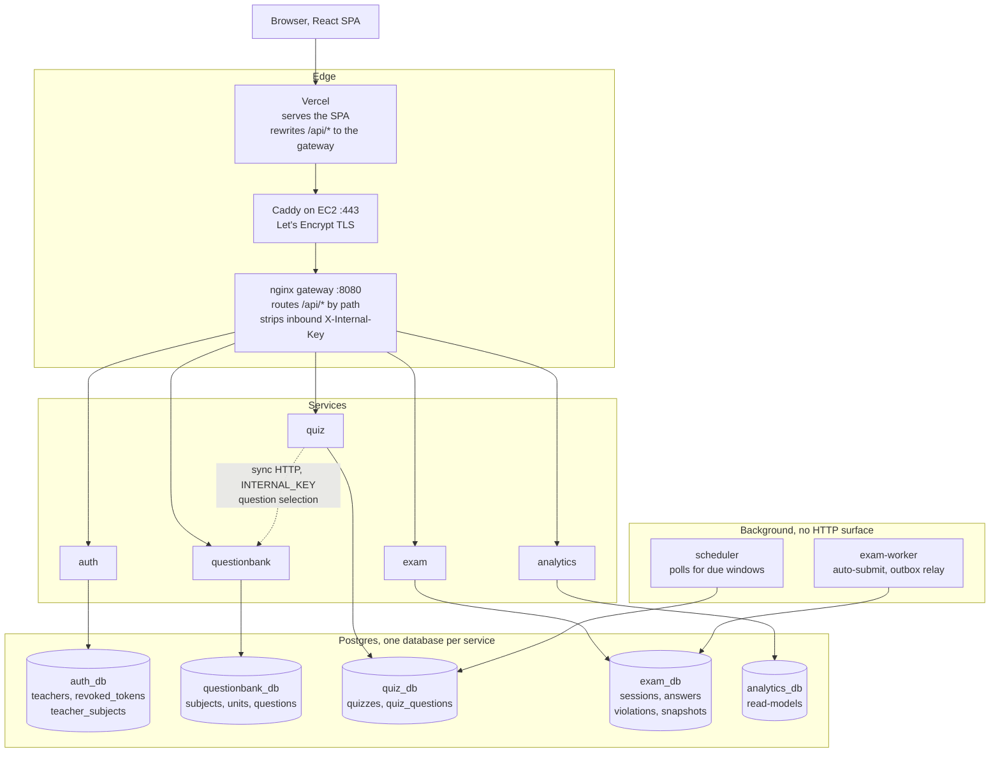
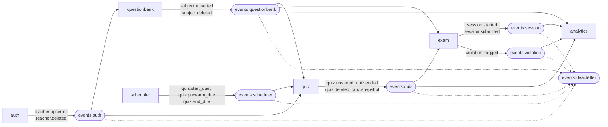
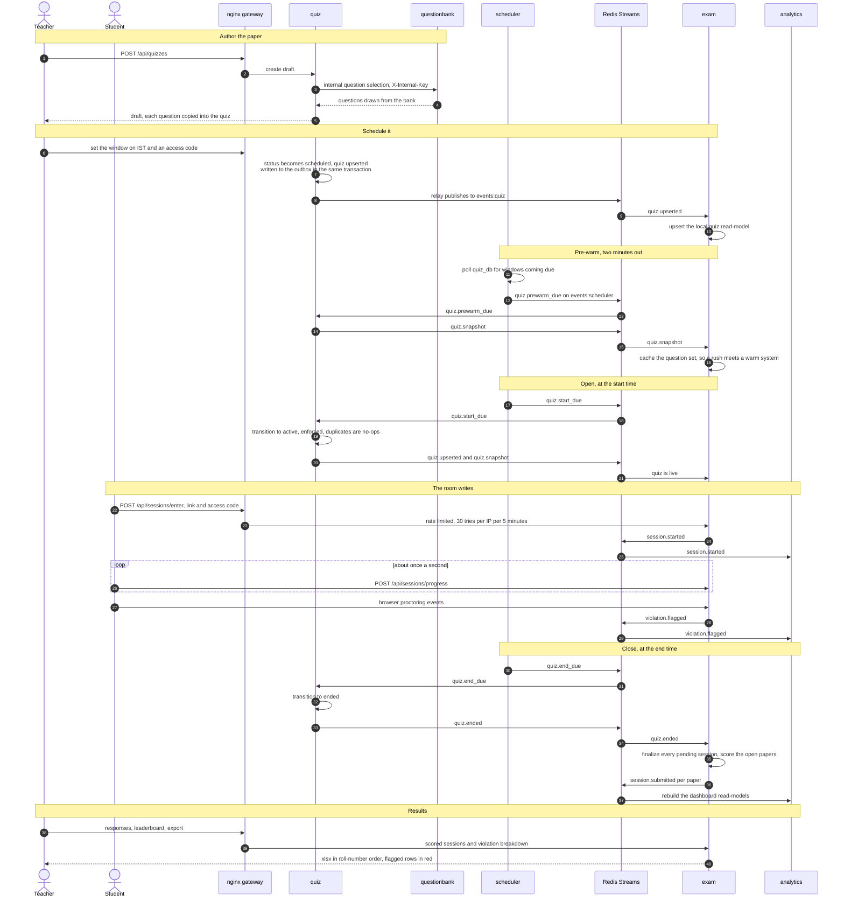

# QuizLoom

QuizLoom is a quiz and live-exam platform for teachers, students, and administrators —
quiz authoring, scheduled activation, live monitoring, response analytics, proctoring
flags, and Excel import/export.

It runs as **six independent services behind an nginx API gateway**, each owning its own
PostgreSQL database and communicating over **Redis Streams** (with a transactional outbox),
plus one guarded internal HTTP call. The React SPA is served by Vercel in production and the
Vite dev server locally.

---

## Features

### Landing page

A static marketing page at `/`. It imports no service client, no auth context and no query
hooks, so opening it contacts nothing: **Sign in** is what first wakes the backend. Cold
starts show a plain "Starting QuizLoom" screen rather than a bare spinner.

### Teacher

- Cookie-based auth, profile updates, password changes, avatar upload/removal.
- Subject / unit / question bank management (including Excel bulk import).
- Manual and auto-generated quiz creation.
- Draft → scheduled → active → ended quiz lifecycle.
- Live quiz insights, response review, violations timeline, leaderboard, and XLSX exports.

### Student

- Enter a quiz via `access_token` + access code (no account needed).
- Timed attempt with autosaved progress.
- Manual submit, or automatic submit when the session/quiz ends.
- Score summary with percentage and scored points.
- Proctoring-aware flow (tab switch, copy/paste, context-menu events).

### Admin

- Environment-backed admin authentication (no DB row).
- Dashboards and teacher management.
- School-wise teacher listing and subject assignment.
- Global teacher operations: list all, remove from school, delete.

---

## Architecture

The gateway is purely an API router; the SPA is served separately by Vercel, and Caddy
terminates HTTPS in front of the gateway in production.



Every service owns its database outright; nothing reads another service's tables. The only
synchronous hop between services is quiz auto-generate asking questionbank to select
questions, guarded by a shared `INTERNAL_KEY` that the gateway strips from inbound requests.

### Event flow

Each service writes events to a **transactional outbox** in the same DB transaction as the
domain change, and a relay publishes them to Redis Streams. A Redis outage or a crash mid-write
therefore cannot lose an event. Consumers ack only after success, with reclaim and a
dead-letter stream on repeated failure.



The scheduler owns no data. It polls quiz_db for windows that have come due and emits the
timer signals that make a quiz open, pre-warm its cache, and close itself.

### One quiz, end to end

The sequence every other diagram is a slice of. Nothing here is a design sketch; the steps come
from `scheduler/src/detect.js`, `quiz/src/jobs/schedulerConsumer.js` and
`exam/src/services/quizEvents.consumer.js`.



Two properties fall out of this shape. A student who never presses Submit is still graded,
because `quiz.ended` drives auto-submit rather than the browser. And a Redis outage delays the
transition without losing it, because every event is already committed to its service's outbox.


| Service                | Owns / database                                                   | Responsibility                                                                 |
| ---------------------- | ----------------------------------------------------------------- | ------------------------------------------------------------------------------ |
| **gateway**      | —                                                                | nginx; routes`/api/*` to services, strips inbound `X-Internal-Key`         |
| **auth**         | teachers, revoked_tokens, teacher_subjects                        | Login, JWT/cookies, teacher management, avatars                                |
| **questionbank** | subjects, units, questions                                        | Subjects/units/questions, internal question selection                          |
| **quiz**         | quizzes, quiz_questions                                           | Quiz CRUD, scheduling, snapshot source                                         |
| **exam**         | student_sessions, student_answers, violation_flags, quiz_snapshot | Live entry, scoring, violations, monitoring (+ a`worker.js` for auto-submit) |
| **analytics**    | event-built read-models                                           | Teacher/admin dashboards                                                       |
| **scheduler**    | none (reads quiz db)                                              | Detects due quizzes, emits timer signals                                       |
| **redis**        | —                                                                | Event bus (Redis Streams) + cache/denylist                                     |

**Configuration.** Every service reads `CLIENT_URLS` for its CORS allowlist. There is no
hardcoded fallback and the value is required by the startup Zod schema, so a service refuses
to boot without it rather than quietly allowing localhost in production.

**Communication.** Services talk asynchronously over Redis Streams (each writes events to a
**transactional outbox** in the same DB transaction as the domain change; a relay publishes
them, so a Redis outage or crash can't lose events). Consumers ack only after success, with
reclaim + dead-letter on failure. The only synchronous cross-service call is quiz
auto-generate → questionbank question selection, guarded by a shared `INTERNAL_KEY`.

Every service runs its own migrations on boot.

> Full architecture, event tables, gateway routing, and a step-by-step run guide live in
> [`docs.md`](./docs.md).

---

## Tech stack

| Layer    | Technology                                   | Purpose                                    |
| -------- | -------------------------------------------- | ------------------------------------------ |
| Frontend | React 18, Vite, React Router                 | SPA routing and rendering                  |
| Frontend | TanStack React Query, Axios                  | Data fetching, caching, mutations          |
| Frontend | Tailwind CSS, Radix UI, React Hook Form, Zod | UI system and validation                   |
| Frontend | Recharts,`xlsx`, lucide-react              | Charts, spreadsheet workflows, icons       |
| Backend  | Node.js 20, Express                          | REST APIs and middleware                   |
| Backend  | PostgreSQL (`pg`)                          | One database per service                   |
| Backend  | `ioredis` (Redis Streams)                  | Event bus, cache, token denylist           |
| Backend  | `jsonwebtoken` (HS256), `bcryptjs`       | Cookie-session JWTs, password hashing      |
| Backend  | `multer` (auth), `exceljs` (exam), Zod   | Avatar upload, XLSX export, validation     |
| Gateway  | nginx                                        | API routing, body limits, header hardening |
| Infra    | Docker Compose, Vercel                       | Backend stack, frontend hosting            |

---

## Project structure

```text
quiz-platform/
├── client/                 # React + Vite SPA (Vercel in prod, Vite :5173 in dev)
│   └── src/pages/marketing/ # landing page at /, imports no service or auth code
├── gateway/                # nginx API gateway (nginx.conf)
├── services/
│   ├── auth/               # teachers, JWT/cookies, avatars, admin
│   ├── questionbank/       # subjects, units, questions
│   ├── quiz/               # quiz CRUD, scheduling, snapshots
│   ├── exam/               # live entry, scoring, violations (+ worker.js)
│   ├── analytics/          # dashboard read-models
│   └── scheduler/          # due-quiz timer signals (no DB)
├── docker/redis/           # Redis image + redis.conf (AOF, volatile-lru)
├── tests/                  # node:test integration smoke tests
├── scripts/                # reset.sh (rebuild stack + flush Redis)
├── docker-compose.yml      # canonical deploy path (uses .env.production)
├── docker-compose.dev.yml  # local overlay (points services at .env.local)
├── ecosystem.config.cjs    # alternative PM2 path (non-canonical)
└── docs.md                 # full architecture & run guide
```

---

## Getting started (local, Docker Compose)

### Prerequisites

- Docker + Docker Compose
- Node.js 20+ (for the client dev server)
- PostgreSQL — five databases reachable from the services (local or managed/Neon)

### Quick start

```bash
git clone https://github.com/prawesh-12/quiz-platform.git
cd quiz-platform

# 1. Create each service's env files from the example and fill them in.
#    There is no plain .env: every service has .env.local and .env.production,
#    and the one that loads is chosen by NODE_ENV at startup.
for s in auth questionbank quiz exam analytics scheduler; do
  cp services/$s/.env.example services/$s/.env.local
  cp services/$s/.env.example services/$s/.env.production
done
# Set per service: DATABASE_URL; the SAME JWT_SECRET everywhere; the SAME
# INTERNAL_KEY in auth/questionbank/quiz; and in auth the ADMIN_* values.
# CLIENT_URLS is required and has no fallback, so a service will refuse to
# start without it. Locally: http://localhost:5173,http://127.0.0.1:5173

# 2. Bring the backend up. The dev overlay points every service at .env.local,
#    so CORS allows localhost and cookies are not marked Secure over plain http.
docker compose -f docker-compose.yml -f docker-compose.dev.yml up --build
# gateway API on http://localhost:8080

# 3. Run the SPA (proxies /api to the gateway, same-origin cookies)
npm install --prefix client
npm run dev --prefix client          # http://localhost:5173
```

Open **http://localhost:5173**. That is the marketing landing page and it contacts no
service; **Sign in** is what first wakes the backend. Sign in with the admin credentials
from `services/auth/.env.local`. The full step-by-step (admin password hash, env reference,
verify flow) is in [`docs.md`](./docs.md) §5.

### Environment files

| File                      | Loaded when                    | Holds                                                        |
| ------------------------- | ------------------------------ | ------------------------------------------------------------ |
| `.env.local`              | `NODE_ENV` is not `production` | localhost origins, `COOKIE_SECURE=false`, local Redis        |
| `.env.production`         | `NODE_ENV=production`          | the deployed origin, `COOKIE_SECURE=true`, in-cluster Redis  |
| `.env.example`            | never, it is the template      | every key a service needs, with no values                     |

Both real files are gitignored. Plain `docker compose up` uses `.env.production`; add
`-f docker-compose.dev.yml` for the local pair.

After changing migrations or event schemas, `npm run reset` rebuilds the stack and flushes
Redis so streams/consumer groups re-bootstrap.

---

## Scripts (root `package.json`)

| Script                            | Does                                                               |
| --------------------------------- | ------------------------------------------------------------------ |
| `npm run setup`                 | Install dependencies for every service + the client                |
| `npm run dev`                   | Dev overlay `docker compose up -d` + start the Vite dev server   |
| `npm run up` / `npm run down` | Dev overlay `up --build` / `docker compose down`               |
| `npm run up:prod`               | `docker compose up --build` with `.env.production`             |
| `npm run reset`                 | Rebuild the stack and flush Redis (`scripts/reset.sh`)           |
| `npm run build`                 | Build the client (`client/dist`)                                 |
| `npm test`                      | Integration smoke tests (`node --test`, against a running stack) |

---

## Auth model

- **Teacher / admin**: an httpOnly **session cookie** (`quiz_session`) carrying a JWT, signed
  and verified with the same `JWT_SECRET` (HS256) across all services. Revocation is tracked
  in the auth DB and mirrored to Redis for fast checks.
- **Student**: progress/submit and violation reporting use an `X-Session-Token` issued on
  entry — no account required.
- **Quiz entry**: `access_token` (in the share link) + access code.
- **Internal**: the one cross-service HTTP call is guarded by `X-Internal-Key`, which the
  gateway strips from all inbound requests so it can't be forged.

---

## Testing

Integration smoke tests run against a live stack through the gateway (no extra deps —
Node's built-in runner + `fetch`):

```bash
export GATEWAY_URL=http://localhost:8080
export TEST_ADMIN_EMAIL=... TEST_ADMIN_PASSWORD=...
export TEST_TEACHER_EMAIL=... TEST_TEACHER_PASSWORD=...
npm test
```

Tests whose required env is unset are skipped, never failed. See [`tests/README.md`](./tests/README.md).

---

## Production

Deployment shape: the **backend** runs as the same Docker Compose stack on any Docker host
(e.g. an Ubuntu EC2 instance, firewall open only on 22/80/443); **[Caddy](https://caddyserver.com)**
sits in front of the gateway (`localhost:8080`) and terminates HTTPS at `api.your-domain.com`
with an automatic Let's Encrypt cert; the **frontend** is hosted on Vercel and rewrites
`/api/*` to that Caddy domain so the SPA calls the API same-origin (keeping the `SameSite=Lax`
cookie).

Set `NODE_ENV=production`, `COOKIE_SECURE=true`, `COOKIE_SAMESITE=lax`, and `CLIENT_URLS` in
each service `.env`, and put the Caddy domain in [`client/vercel.json`](./client/vercel.json).
Full step-by-step (EC2 + Docker, Caddy reverse proxy, Vercel) in [`docs.md`](./docs.md) §6.

---

## License

MIT — see [`LICENSE`](./LICENSE).
