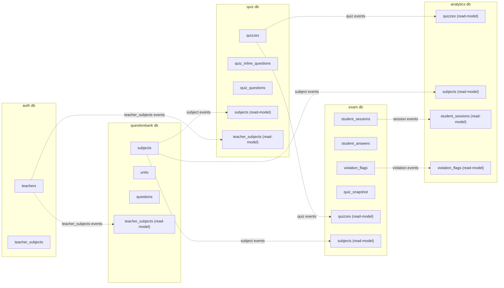
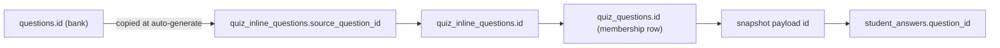
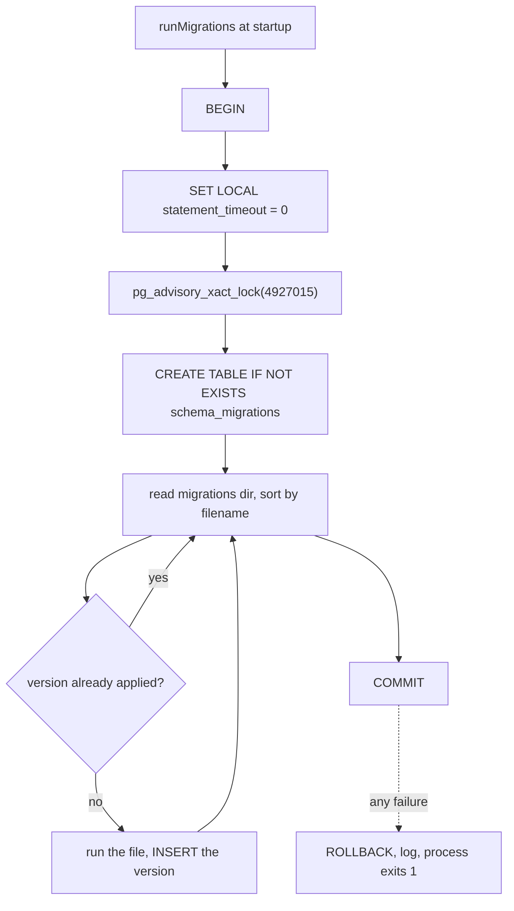

# Databases

Five PostgreSQL databases, one per stateful service, each on its own Neon project. No service connects to another service's database, with one documented exception.

## Ownership

| Database | Service | Owns | Read-models it keeps |
|---|---|---|---|
| auth | auth | `teachers`, `revoked_tokens`, `teacher_subjects`, `outbox_events` | none |
| questionbank | questionbank | `subjects`, `units`, `questions`, `outbox_events` | `teacher_subjects` |
| quiz | quiz | `quizzes`, `quiz_inline_questions`, `quiz_questions`, `outbox_events` | `subjects`, `teacher_subjects` |
| exam | exam | `student_sessions`, `student_answers`, `violation_flags`, `quiz_snapshot`, `outbox_events` | `quizzes`, `subjects` |
| analytics | analytics | nothing | `quizzes`, `subjects`, `student_sessions`, `violation_flags` |

The Scheduler has no database. It connects to the quiz database read-only. See [Scheduler](./7_scheduler.md).

## Owned data versus read-models

Solid boxes are owned. Dotted arrows are event-fed projections, described in [Events](./9_events.md).

A read-model is always a subset. The quiz database's `subjects` has three columns; the question bank's has four plus indexes. Each projection carries only what its service queries.

Rules that hold everywhere:

- **No cross-database foreign keys.** Columns like `created_by`, `subject_id` and `question_id` are plain integers where the referenced row lives in another service.
- **Read-models are never written by a request handler**, only by a stream consumer.
- **Projections are idempotent**: every write is `ON CONFLICT DO UPDATE` or `DO NOTHING`.

## Question identity across services

This trips people up, so it is worth being explicit.

The id a student's answer points at is the **`quiz_questions.id`**, the membership row. It is also the id in the snapshot payload and the id the browser sends. The bank question id survives only as `source_question_id`, for tracing.

## Migrations

Each service owns a numbered `.sql` directory and applies it at boot.

Design points:

- **One transaction for the whole run.** Postgres DDL is transactional, so a run is all-or-nothing.
- **A transaction-scoped advisory lock**, which is pooler-safe: pinned to one backend and released automatically on commit or rollback. Several instances booting at once serialise instead of colliding.
- **Every file is idempotent** (`IF NOT EXISTS`), so a re-run is a no-op even outside the version table.
- **A migration failure stops the service.** Booting on a half-applied schema is worse than not booting.
- `npm run db:migrate --prefix services/<name>` runs the same code as a one-off.

The Exam worker also migrates on boot, so it can start before the API. `WORKER_RUN_MIGRATIONS=false` disables that.

## Connection pooling

`config/db.js` is the same shape in every service.

| Setting | Env | Default |
|---|---|---|
| Pool size | `PG_POOL_MAX` | 20 |
| Idle timeout | `PG_POOL_IDLE_TIMEOUT_MS` | 10000 |
| Connect timeout | `PG_POOL_CONNECTION_TIMEOUT_MS` | 3000 |
| Statement timeout | `PG_STATEMENT_TIMEOUT_MS` | 15000 |
| SSL | derived from `NODE_ENV` | `rejectUnauthorized: false` in production |

`statement_timeout` is applied on every new connection, so one stuck query cannot hold a pool slot forever.

`pool.query` is wrapped so every query's duration is added to the current request's `dbMs`, which is then logged on the one-line-per-request log entry.

Connection strings point at Neon's **pooler** endpoints (`-pooler` in the host). Neon's free tier scales compute to zero, so every service pings `SELECT 1` every `KEEPWARM_INTERVAL_MS` (240000, four minutes) to keep its endpoint warm. Set `KEEPWARM_ENABLED=false` to stop it.

## Transactions

`utils/withTransaction.js` wraps `BEGIN`, the callback, and `COMMIT` or `ROLLBACK`. Repositories always take a `db` argument, which is either the pool or a transaction client, so the caller decides the boundary.

Every write that also emits an event runs inside `withTransaction`, with `enqueueOutboxEvent` on the same client.

Two places take row locks:

- `SELECT ... FOR UPDATE OF ss` on a student session, so concurrent saves and submits serialise.
- `SELECT ... FOR UPDATE SKIP LOCKED` on pending sessions during auto-submit and on outbox rows during relay, so several workers can share the work.

## Indexes worth knowing

| Table | Index | Why |
|---|---|---|
| `student_answers` | unique `(session_id, question_id)` | Makes answer saving an upsert |
| `student_sessions` | unique `session_token` | Session lookup on every student request |
| `quizzes` (quiz db) | `access_token`, `(access_token, status)` | Student entry by share link |
| `quizzes` (quiz db) | `scheduled_start`, `scheduled_end` | Scheduler detection queries |
| `quizzes` (quiz db) | `(created_by, status)` | Teacher quiz list |
| `outbox_events` | partial on `next_attempt_at WHERE status = 'pending'` | Relay only scans due rows |
| `student_sessions` (analytics) | `started_at`, `(quiz_id, started_at)` | Dashboard aggregates and trend |
| `revoked_tokens` | `expires_at` | Cleanup of expired revocations |

## Timestamps

Quiz scheduling columns are `timestamp without time zone` holding **India wall-clock** time, and every comparison uses `NOW() AT TIME ZONE 'Asia/Kolkata'`. Analytics uses `TIMESTAMPTZ` and compares against plain `NOW()`.

That is a real inconsistency between the two. It does not currently produce wrong dashboards because Analytics only groups by `started_at`, which it receives as an ISO string from the Exam service. Anything that compares a quiz schedule against an analytics timestamp would need care.

## Failure cases

| Situation | Behavior |
|---|---|
| Database unreachable at boot | Migrations fail, process exits 1, container restarts |
| Database unreachable while running | `/api/ready` returns 503; requests surface a mapped 503 message |
| Query exceeds 15s | Postgres cancels it, the connection is released |
| Two instances boot together | Advisory lock serialises the migration run |
| A projection falls behind | The owning service is unaffected; the read-model is stale until it catches up |
| Neon endpoint cold | First query is slow; keepwarm is what normally prevents it |

## Related documentation

- [Architecture](./1_architecture.md)
- [Events and async processing](./9_events.md)
- [Deployment](./12_deployment.md)
