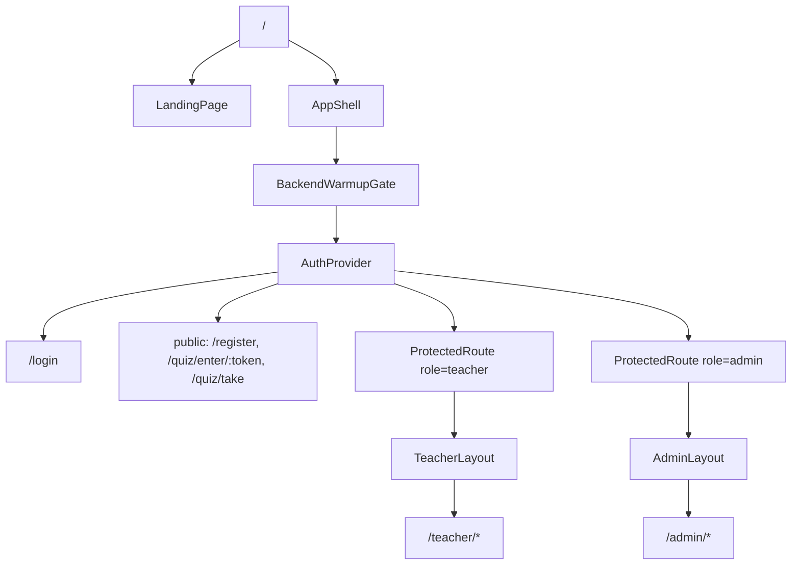
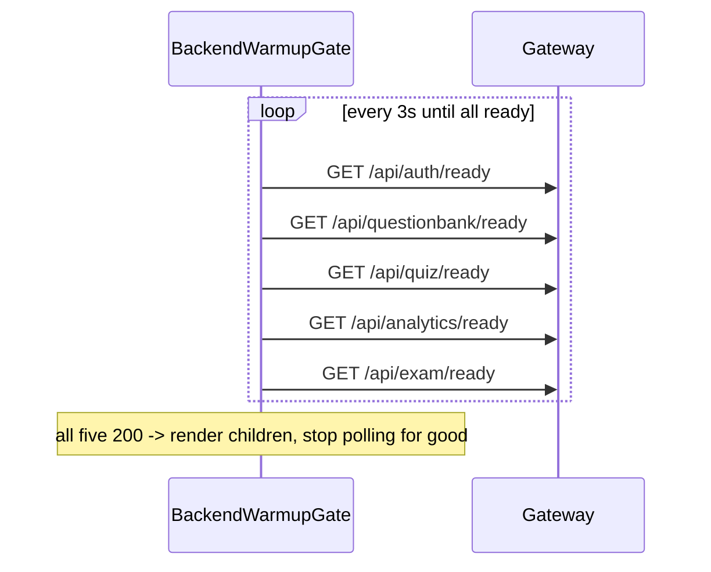
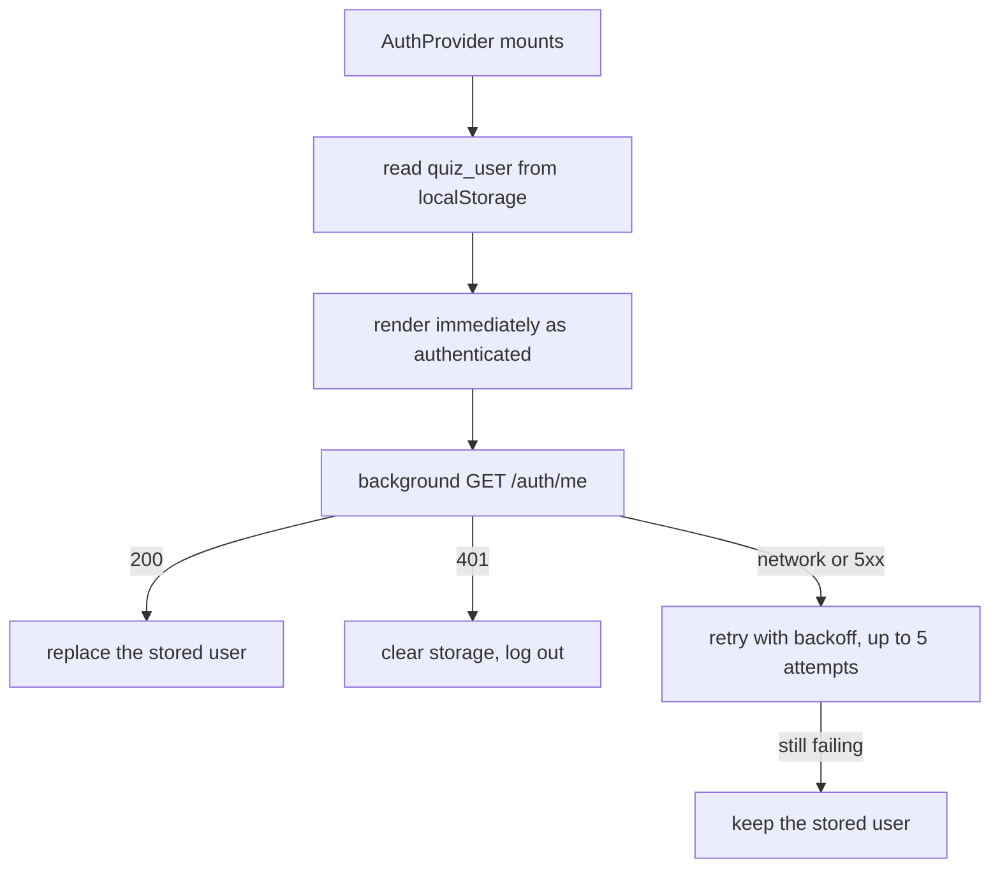
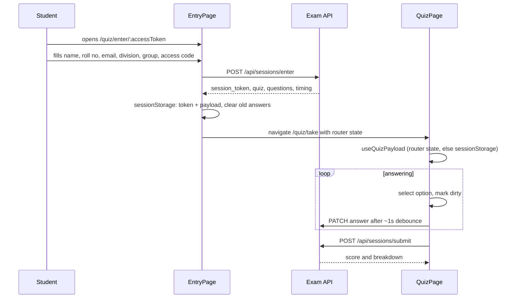

# Frontend

A single React SPA built with Vite. Three audiences share one bundle: the marketing landing page, the teacher and admin app, and the student quiz runner. It talks to nothing except `/api` on its own origin.

## Stack

| Concern | Choice |
|---|---|
| Build | Vite 5, React 18 |
| Routing | react-router-dom 6 |
| Server state | TanStack Query 5 |
| Forms | react-hook-form + zod |
| HTTP | axios with `withCredentials` |
| UI | Tailwind + Radix primitives (shadcn-style) in `components/ui` |
| Charts | recharts, lazily chunked |
| Spreadsheets | xlsx, lazily chunked |

## Layout

```text
client/src/
├── App.jsx              route table, error boundary, suspense
├── main.jsx             query client, router, theme variables
├── components/
│   ├── layout/          teacher and admin shells, sidebars
│   ├── shared/          BackendWarmupGate, ProtectedRoute, Avatar, spinners
│   ├── teacher/         dashboard, quiz builder, live view widgets
│   ├── admin/           teacher management dialogs
│   ├── quiz/            countdown, equation input
│   └── ui/              Radix-based primitives
├── pages/
│   ├── marketing/       landing page and its sections
│   ├── auth/            login, register
│   ├── teacher/         dashboard, question bank, quiz pages
│   ├── admin/           dashboards, teacher lists
│   └── student/         entry, quiz runner and its hooks
├── services/            one module per backend area, all through api.js
├── hooks/               auth, proctoring, timer, prefetch, toast
├── lib/                 apiBaseUrl, theme variables, cn helper
└── utils/               excel parsing, clipboard, jitter, session keys
```

## Routing



The landing page sits **outside** `AppShell` on purpose. A visitor who lands on `/` contacts no backend service at all: no warmup poll, no `/auth/me`. Only entering the app pays that cost.

Every page except the login page is `React.lazy`. `lazyWithPreload` keeps a handle on the import so routes can be prefetched on idle, and a thin progress bar renders while a chunk is in flight. The suspense fallback waits 400ms before showing a spinner, so a fast chunk never flashes one.

## Backend warmup



Every request has a 2.5s abort timeout. The gate flips a module-level flag once satisfied, so remounting it never re-shows the loader.

It checks all five services, not just `/api/health`, because the health catch-all only proves Exam is alive. Services sit on Neon databases that scale to zero, so a first visit after an idle period can genuinely need thirty seconds of cold start. The on-screen message changes from "Starting QuizLoom" to "Almost there" at 20 seconds so it does not look frozen.

## Auth in the browser

The token lives in an httpOnly cookie the JavaScript cannot read. `localStorage` holds only the user object, under `quiz_user`, for instant rendering.



Only a definite 401 logs someone out. A blip during a cold start does not. That is the whole reason for the retry ladder: without it, a slow backend would sign teachers out at exactly the moment the system was least able to sign them back in.

The axios interceptor in `services/api.js` handles the other half:

- Non-401 errors show a toast, unless the caller passed `skipErrorToast`.
- A 403 is a valid session with the wrong role, so the session is kept.
- A 401 retries the request once, then falls back to a single shared `/auth/me` probe. Only a 401 on that probe forces logout.
- Logout is announced with a `quiz:session-expired` window event, and the router navigates to `/login`. No document reload, because reloading would re-run the warmup gate and refetch the entire app.

## The student quiz runner

Two pages and six hooks.



| Hook | Job |
|---|---|
| `use-quiz-payload` | Router state on a fresh navigation, `sessionStorage` on a reload |
| `use-quiz-timing` | Tracks the server clock offset, drives the countdown, refreshes phase |
| `use-quiz-autosave` | Debounce, flush, retry with backoff |
| `use-quiz-submit` | Final submit and result |
| `use-quiz-runtime` | Ties the above together for the page |
| `useProctoring` | Violation listeners |

Reload resilience: the session token, the entry payload, chosen answers, and the not-yet-synced answers all live in `sessionStorage`. A mid-quiz refresh restores selections and the countdown without losing anything.

Autosave detail worth knowing: only **dirty** answers are sent, and they are dropped from the dirty set only after the server confirms. A failed save retries with exponential backoff and jitter rather than waiting for the next answer change. Pending answers are also flushed on `visibilitychange` to hidden and on `pagehide`, so closing the tab does not lose the last selection.

The countdown never trusts the device clock. Every timing response carries `server_now`, and the hook stores the offset.

## Teacher polling

TanStack Query intervals, each wrapped in `withJitter` (plus or minus 20%) so many browsers do not align on the same tick.

| Screen | Interval |
|---|---|
| Ongoing quiz list | 2s |
| Scheduled quiz list | 3s |
| Live quiz view, dashboard status | 5s |
| Responses table | 10s |
| Quiz library | 10s |

The 2s and 5s polls are why the Exam service caches live stats for three seconds; see [Exam](./6_exam.md).

Query defaults: 15s stale time, no refetch on window focus, and retries only on 5xx. A 4xx is a settled answer, and retrying it just repeats the toast.

## Build

`vite.config.js` splits vendors by hand:

| Chunk | Contents |
|---|---|
| `react-vendor` | react, react-dom, router, hook-form |
| `query` | TanStack Query |
| `charts` | recharts and d3, only loaded on a dashboard |
| `excel` | xlsx, the heaviest dependency, excluded from pre-bundling |

Everything else is left to Rollup's automatic chunking. The chunk size warning limit is 400kb.

## Talking to the API

`lib/apiBaseUrl.js` resolves the base URL:

- `VITE_API_URL` empty (the intended setting) gives `/api`, same-origin.
- A value without a trailing `/api` gets one appended.

Same-origin is what keeps the session cookie host-only and `SameSite=Lax` workable. Two mechanisms make it true:

- Locally, the Vite dev server proxies `/api` to `http://localhost:8080`.
- In production, `client/vercel.json` rewrites `/api/:path*` to `https://quizloom.duckdns.org/api/:path*`, and everything else to `/index.html` for client-side routing.

`public/_redirects` carries the same SPA fallback for a Netlify-style host.

Service modules (`services/*.js`) are thin wrappers over `api`. Components never call axios directly.

## Failure cases

| Situation | Behavior |
|---|---|
| A service is cold or down at load | Warmup gate holds on the loading screen and keeps polling |
| Session expires mid-use | Interceptor probes `/auth/me`, then routes to `/login` |
| A lazy chunk fails to load | Error boundary shows the message instead of a blank screen |
| Autosave fails | Answers stay dirty in `sessionStorage` and retry with backoff |
| Quiz ends while a student is answering | Save returns 409 with `session_closed`, the page switches to the result view |
| Student reloads mid-quiz | Payload and answers restore from `sessionStorage` |

## Related documentation

- [Exam](./6_exam.md)
- [Authentication](./3_authentication.md)
- [Deployment](./12_deployment.md)
