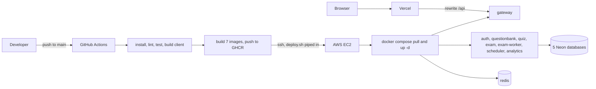
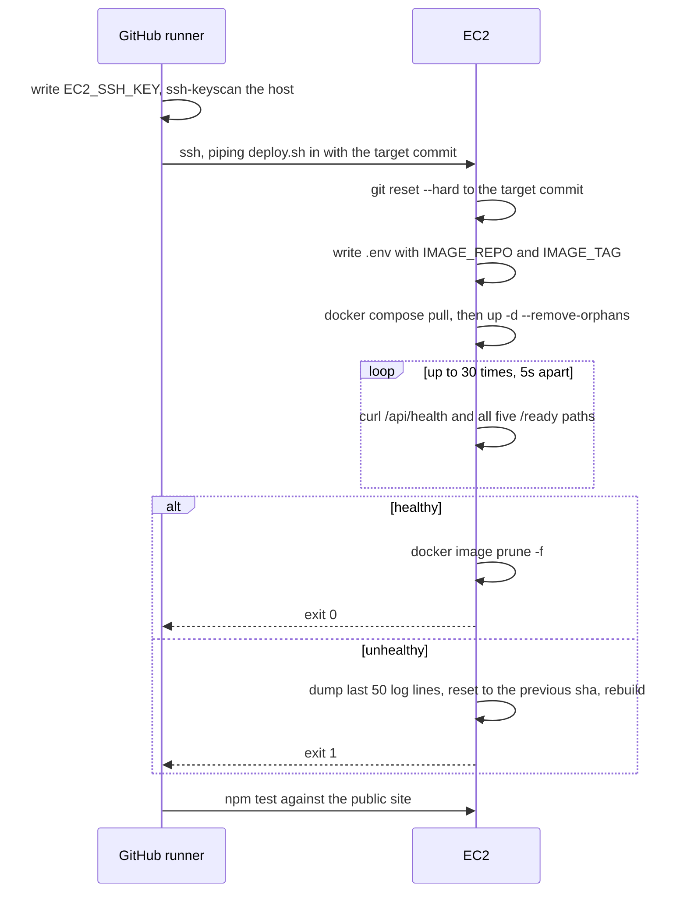

# Deployment

The backend runs as a Docker Compose stack on one AWS EC2 instance. The frontend is built and hosted by Vercel. Databases are managed Neon projects. Pushing to `main` deploys the backend.

This document is the reference: what every piece is, and what every setting does. For steps to follow in order, use the guides instead:

- [Running locally](./local_deploy.md) — fresh clone to a working stack on your machine
- [Deploying to production](./prod_deploy.md) — empty server to a site that redeploys on push

## Where everything runs



The client is not deployed by this workflow. Vercel builds it from the same repository on its own. CI builds it too, but only to prove the build is not broken.

## The Compose stack

`docker-compose.yml` is the production definition. Nine containers. Every built image is named `${IMAGE_REPO:-quizloom}/<service>:${IMAGE_TAG:-dev}`, so the same file builds locally and pulls published images on the server, depending on whether those two variables are set:

| Container | Image | Ports | Notes |
|---|---|---|---|
| `quizloom-redis` | built from `docker/redis` | none in production | healthcheck on `redis-cli ping` |
| `quizloom-gateway` | `nginx:1.27-alpine` | 8080 to 80 | mounts `gateway/nginx.conf` read-only |
| `quizloom-auth` | built | `expose 5000` | |
| `quizloom-questionbank` | built | `expose 5000` | |
| `quizloom-quiz` | built | `expose 5000` | gets `QUESTIONBANK_INTERNAL_URL` |
| `quizloom-analytics` | built | `expose 5000` | |
| `quizloom-exam` | built | `expose 5000` | |
| `quizloom-exam-worker` | same image as exam | none | `command: ["node", "worker.js"]` |
| `quizloom-scheduler` | built | none | |

Every service waits for `redis: service_healthy`, and every one is `restart: unless-stopped`.

Service ports use `expose`, not `ports`, so the gateway is the only container reachable from outside the Docker network. Redis is published on `127.0.0.1:6379` by `docker-compose.dev.yml` alone, for `redis-cli` and the event tests, so a production host never exposes it.

Each service reads its own `.env.production` through `env_file`, with `REDIS_URL` overridden in Compose to point at the `redis` service name.

`docker-compose.dev.yml` is a small overlay that swaps every `env_file` to `.env.local`. Local runs use both files:

```bash
docker compose -f docker-compose.yml -f docker-compose.dev.yml up -d
```

which is what `npm run dev` and `npm run up` do.

## CI/CD

`.github/workflows/ci-cd.yml`, two jobs.

**Lint and build** runs on every push and pull request:

1. `npm install` at the root, for the client, and for every service.
2. `npm run lint`, which is ESLint over `services/`, `tests/` and `client/src`. Configured in [`eslint.config.mjs`](../eslint.config.mjs).
3. `npm run test:unit`, then `npm run test:events` against a Redis service container.
4. Build the client. Vercel does the real build; this only proves it is not broken.

**Build and push images** runs only on a push to `main`. A matrix builds all seven images in parallel and pushes them to `ghcr.io/<owner>/quizloom/<service>:<sha>`, with a per-image GitHub Actions layer cache. Nothing is built on the server, which is what lets a 2 GB instance run this stack: building nine images while nine containers are running needs far more memory than running them does.

**Deploy to EC2** runs only if the images pushed, in the `production` environment, under `concurrency: deploy-production` so two deploys never overlap.



The runner SSHes to the host over the public internet with `EC2_SSH_KEY`, so port 22 is open in the security group and password login is off. The integration tests then run against the public site over HTTPS, not against port 8080 directly.

`deploy.sh` is **piped in over SSH** rather than executed from the checkout. That way the host runs this commit's version of the script, and a restart cannot pull the running script out from under itself.

The workflow passes `IMAGE_REPO` and a short-lived `GHCR_TOKEN` (the run's own `GITHUB_TOKEN`) so the host can pull private images without a stored credential. `deploy.sh` writes `IMAGE_REPO` and `IMAGE_TAG` into `/opt/quizloom/.env`, which Compose reads on its own, so any later `docker compose` command on the box acts on the deployed images.

Rollback is automatic: if the health loop never passes, the script resets to the previous commit and rebuilds. If the rollback is also unhealthy it says so and exits non-zero, which fails the workflow.

Health means all six paths answer: `/api/health` plus each service's `/ready`. See [API gateway](./2_api_gateway.md).

## Required GitHub secrets

| Secret | Purpose |
|---|---|
| `EC2_HOST`, `EC2_USER`, `EC2_SSH_KEY` | SSH to the host |
| `GATEWAY_URL` | Public site URL for the post-deploy tests |
| `TEST_ADMIN_EMAIL`, `TEST_ADMIN_PASSWORD` | Optional, enables smoke tests |
| `TEST_TEACHER_EMAIL`, `TEST_TEACHER_PASSWORD` | Optional, teacher-scoped smoke tests |

`APP_DIR` is a workflow env var, `/opt/quizloom` by default. The test step always runs; the tests themselves skip when the `TEST_*` secrets are absent, so no conditional is needed in the workflow.

## Environment configuration

There is no plain `.env`. Every service has `.env.local` and `.env.production`, and `index.js` picks one by `NODE_ENV` before anything else loads. Both are gitignored; only `.env.example` is committed. On the server the `.env.production` files live outside git, which is why `git reset --hard` during a deploy does not touch them.

Required at boot, enforced by zod, process throws if missing:

| Service | Required |
|---|---|
| auth | `CLIENT_URLS`, `DATABASE_URL`, `JWT_SECRET` |
| questionbank | `CLIENT_URLS`, `DATABASE_URL`, `JWT_SECRET` |
| quiz | `CLIENT_URL`, `CLIENT_URLS`, `DATABASE_URL`, `JWT_SECRET` |
| exam | `CLIENT_URLS`, `DATABASE_URL`, `JWT_SECRET` |
| analytics | `CLIENT_URLS`, `DATABASE_URL`, `JWT_SECRET` |
| scheduler | `DATABASE_URL` |

Values that must agree across services:

- `JWT_SECRET` identical everywhere, or tokens issued by Auth fail elsewhere.
- `INTERNAL_KEY` identical in quiz and questionbank, or auto-generate returns 403.
- `REDIS_URL` pointing at the same instance everywhere.
- Auth's `DATABASE_URL` distinct per service, except the scheduler which shares the quiz database.

Other settings worth knowing:

| Variable | Default | Effect |
|---|---|---|
| `COOKIE_SECURE` | false | Must be true behind HTTPS |
| `COOKIE_SAMESITE` | lax | Works because the SPA is same-origin |
| `CLIENT_URL` (quiz) | none | Builds student share links |
| `CLIENT_URLS` | none | CORS allowlist, comma-separated |
| `KEEPWARM_ENABLED` | true | Neon anti-cold-start ping |
| `KEEPWARM_INTERVAL_MS` | 240000 | |
| `PG_POOL_MAX` | 20 | Per service, per process |
| `AUTO_SUBMIT_BATCH_SIZE` | 100 | Auto-submit batch |
| `EVENT_STREAM_MAXLEN` | 10000 | Approximate stream cap |
| `CONSUMER_BLOCK_MS` | 5000 | How long `XREADGROUP` blocks |
| `CONSUMER_RECLAIM_IDLE_MS` | 60000 | Idle time before a failed event is retried |
| `CONSUMER_RECLAIM_INTERVAL_MS` | 30000 | How often the consumer looks for stale entries |
| `CONSUMER_MAX_ATTEMPTS` | 5 | Deliveries before an event is dead-lettered |
| `CONSUMER_DEADLETTER_STREAM` | `events:deadletter` | Where dead events go |
| `RATE_LIMIT_DISABLED` | false | Ignored in production |
| `SENTRY_DSN` | unset | Only flips an internal flag today |

## Frontend deployment

Vercel builds `client/` and serves the static output. `client/vercel.json` does two things:

- Rewrites `/api/:path*` to `https://your-domain.com/api/:path*`, so the browser only ever sees its own origin.
- Rewrites everything else to `/index.html` for client-side routing.

Changing the backend host means editing that file and redeploying the frontend.

TLS terminates in front of the gateway at `your-domain.com`. The Compose stack itself serves plain HTTP on port 8080; the certificate and the reverse proxy are host configuration, not part of this repository.

## Local development

Full walkthrough: [Running locally](./local_deploy.md). The short version:

```bash
npm run setup   # install every service and the client
npm run dev     # compose up with the dev overlay, then vite
npm run down    # stop the stack
npm run reset   # rebuild, recreate, flush Redis
```

`scripts/reset.sh` is the one to reach for after changing a migration or an event schema. It stops the stack, optionally rebuilds (`--no-build` to skip, `--hard` to prune build cache), starts it, then runs `FLUSHALL` so consumer groups and streams bootstrap from scratch. It waits for the gateway to answer `/api/health` before returning.

Flushing Redis deletes undelivered stream entries. Do not run it against production.

## The PM2 alternative

`ecosystem.config.cjs` describes the same services under PM2, with the exam API in cluster mode. It is not the deploy path and nothing in CI uses it. The gateway's `nginx.conf` targets Compose service names, so a PM2 host needs its own gateway config with localhost ports. Do not mix the two.

## Not implemented

Worth knowing before assuming otherwise:

- No container healthchecks except on Redis.
- No resource limits on any container.
- No TLS or security headers inside the repo.
- No log shipping. Logs are JSON on stdout and stay in Docker.
- `SENTRY_DSN` sets a flag; `captureException` only logs. There is no error monitor wired up.
- No database backup or restore procedure in the repo. Neon's own retention is the whole story.

## Related documentation

- [Running locally](./local_deploy.md)
- [Deploying to production](./prod_deploy.md)
- [Architecture](./1_architecture.md)
- [API gateway](./2_api_gateway.md)
- [Databases](./10_databases.md)
- [Testing](./13_testing.md)
