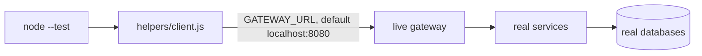

# Testing

Three layers. Unit tests over the pure logic, which need nothing running. Event tests against a real Redis. Integration tests against a live gateway, which need the whole stack. No framework beyond `node --test`, and the only stand-in anywhere is a fake database client in one file.

## What exists

```text
tests/
├── package.json
├── helpers/
│   └── client.js              zero-dependency HTTP client with a cookie jar
├── unit/                      no stack, no network, runs on every push
│   ├── scorer.test.js         marking a submission
│   ├── quiz-timing.test.js    working out a quiz's window
│   ├── quiz-window.test.js    which phase a quiz is in, and the student's timer
│   ├── quiz-lifecycle.test.js the status state machine
│   ├── ttl-cache.test.js      the in-process cache
│   └── text.test.js           small utilities
├── events/                    needs a Redis, nothing else
│   └── consumer.test.js       retries, dead-lettering, consumer groups
└── integration/               needs a live gateway
    ├── gateway.test.js        routing, readiness, and every protected path
    ├── auth.test.js           cookie session lifecycle
    └── subjects.test.js       subject listing and role scoping
```

| Command | Runs |
|---|---|
| `npm run test:unit` | 51 cases, nothing needs to be running |
| `npm run test:events` | 6 cases, skipped unless `REDIS_URL` points at a reachable Redis |
| `npm run test:integration` | 25 cases, skipped unless a gateway answers |
| `npm test` | all three |

## The unit layer

These import service source files directly and call pure functions. No database, no Redis, no HTTP, no `node_modules`. They run in about a tenth of a second, which is why CI runs them on every push and every pull request.

| File | Covers | Where the code lives |
|---|---|---|
| `scorer.test.js` | Points, unanswered questions, duplicate answers, answers for questions not in the quiz | `services/exam/src/services/scorer.service.js` |
| `quiz-timing.test.js` | Scheduled vs active, derived end times, the 15 minute default, India-time parsing, rejecting an end before the start | `services/quiz/src/services/quizTiming.service.js` |
| `quiz-window.test.js` | Which phase a quiz is in, the student's countdown, falling back to `created_at` and to the default duration | `services/exam/src/services/quizTiming.service.js` |
| `quiz-lifecycle.test.js` | Which status moves are allowed, activating a future-dated quiz as `scheduled`, the finalize flag, share-token creation | `services/quiz/src/services/quizLifecycle.service.js` |
| `ttl-cache.test.js` | Expiry, size cap, one factory run for concurrent callers, not caching failures | `services/exam/src/utils/ttlCache.js` |
| `text.test.js` | Trimming to null, share-token shape | `services/exam/src/utils/text.js`, `services/quiz/src/utils/accessToken.js` |

`quiz-lifecycle.test.js` passes a fake database client that records the `UPDATE` it is handed, so the state machine is tested without a database. That is the only stand-in anywhere in the suite.

## The integration layer



True end-to-end. The stack has to be running, and nothing is stubbed.

`helpers/client.js` is about sixty lines over Node's built-in `fetch`. It keeps a cookie jar, so a login is followed by authenticated requests. That is the whole point: the auth model is cookie-based and a client without a jar cannot exercise it.

**`gateway.test.js`** needs no credentials, only a running stack:

- `/api/health` answers 200.
- All five `/api/<service>/ready` paths answer 200, which also proves each service reached its database.
- Nine protected paths answer 401 to an anonymous request, covering all four services behind the gateway.
- `/` is 404, because the gateway does not serve the website.
- An unknown `/api` path is 404.
- `/internal/questions/select` is 404 from outside, even with a forged `X-Internal-Key`. The gateway has no route to it at all.

**`auth.test.js`** covers the cookie session lifecycle:

- `/api/auth/me` without a cookie is 401.
- Wrong credentials fail and set no cookie.
- Login sets `quiz_session`, `/me` returns the user, logout invalidates it, and the next `/me` is 401 immediately.

That last assertion is the one that matters. It proves the revocation write and the Redis denylist land before the next request, which is the behavior described in [Authentication](./3_authentication.md).

**`subjects.test.js`** covers listing and role scoping: `/api/subjects` needs a session, an admin can list through both `/api/admin/subjects` and `/api/subjects`, and a teacher can list their own.

## The event layer

`tests/events/consumer.test.js` runs the real consumer from `services/exam/src/config/eventConsumer.js` against a real Redis. No fakes: it adds entries with `XADD` and reads `XPENDING` to check what was acked.

| Case | What it proves |
|---|---|
| Delivers an event added before the consumer started | The group is created at offset `0`, so nothing already in the stream is skipped |
| Acks a handled event | Nothing is left pending after success |
| Leaves a failed event pending | A throwing handler does not ack, so the event is not lost |
| Retries and then acks | A reclaimed entry is handled again and acked once it works |
| Dead-letters an event that keeps failing | After the attempt limit it lands on the dead-letter stream with its original stream, id and attempt count, is acked, and stops coming back |
| Two groups each get a copy | Separate consumer groups have independent cursors |

The consumer's timings would make this take five minutes at production settings, so they are read from the environment and the test turns them down:

| Variable | Default | In the test |
|---|---|---|
| `CONSUMER_BLOCK_MS` | 5000 | 100 |
| `CONSUMER_RECLAIM_IDLE_MS` | 60000 | 150 |
| `CONSUMER_RECLAIM_INTERVAL_MS` | 30000 | 50 |
| `CONSUMER_MAX_ATTEMPTS` | 5 | 2 |
| `CONSUMER_DEADLETTER_STREAM` | `events:deadletter` | `test:deadletter` |

Set none of these in production and the behaviour is exactly what it was. The last one keeps test failures out of the real dead-letter stream. Each case uses its own stream and group and deletes them afterwards.

CI runs this against a Redis service container. Locally, set `REDIS_URL` and it runs; leave it unset and it skips.

## Credentials and skipping

Credentials come from environment variables, never the repository:

| Variable | Used by |
|---|---|
| `GATEWAY_URL` | all integration tests, defaults to `http://localhost:8080` |
| `TEST_ADMIN_EMAIL`, `TEST_ADMIN_PASSWORD` | auth, subjects |
| `TEST_TEACHER_EMAIL`, `TEST_TEACHER_PASSWORD` | subjects |

Every integration suite skips for one of two reasons, and says which: no gateway answered `/api/health`, or a credential is missing. `gatewayUnreachable()` and `requireEnv(...)` in `helpers/client.js` return the reason, and each case calls `t.skip(reason)`.

So the suite is green on a machine with nothing running, and only asserts where it can. The trade-off is real: a missing secret looks the same as a passing run unless you read the output. If CI says all tests passed, check how many were skipped.

## CI checks

From `.github/workflows/ci-cd.yml`:

| Check | When | What it proves |
|---|---|---|
| `npm install` at the root, client, and each service | every push and PR | Dependencies resolve |
| `npm run lint` | every push and PR | ESLint finds no errors in services, tests, or the client |
| `npm run test:unit` | every push and PR | Scoring, timing, the status machine and the cache behave |
| `npm run test:events` | every push and PR | Retries and dead-lettering work against a real Redis |
| `npm run build` | every push and PR | The client builds |
| Health loop in `deploy.sh` | deploy | Every service answers ready, or the deploy rolls back |
| `npm run test:integration` | deploy | Routing and auth work against the real site |

The unit and event tests are what actually guard a pull request. The rest only proves the code installs, lints and builds.

## Gaps

Stated plainly, because assuming coverage that is not there is worse than knowing it is missing.

- **No test for the student journey.** Entering with a code, autosave, submit and auto-submit are the highest-risk paths and nothing automated touches them. This needs a teacher to create a quiz through the API first, so it belongs in the integration layer.
- **The outbox and the relay are untested.** Consumer retries and dead-lettering now have real coverage, but the producer half (writing the event in the same transaction, then relaying it to Redis) does not. That one needs a database as well as a Redis.
- **No test for Excel import**, which is the most format-sensitive code in the repo.
- **No load test** in the repository. `extras/loadtest/quiz_load.js` exists locally but `extras/` is gitignored.
- `scripts/reset.sh` points at `tests/SMOKE_CHECKLIST.md`, which does not exist.

## Testing something manually

```bash
npm run reset                          # clean stack, flushed Redis
curl -s localhost:8080/api/health
for s in auth questionbank quiz analytics exam; do
  curl -s -o /dev/null -w "$s %{http_code}\n" localhost:8080/api/$s/ready
done
```

Then drive a quiz end to end: create it, activate it, open the share link in a private window, answer, submit, and check the teacher's live stats and responses page.

## Related documentation

- [Running on your own machine](./local_deploy.md)
- [Deployment](./12_deployment.md)
- [Authentication](./3_authentication.md)
- [Events and async processing](./9_events.md)
