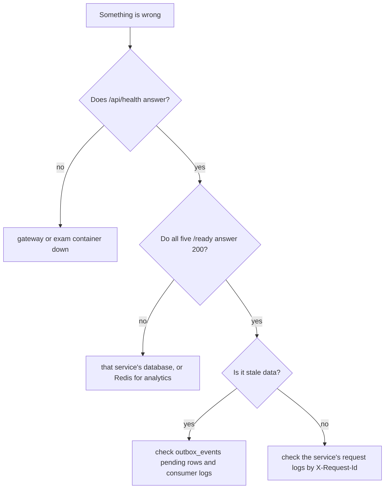

# Troubleshooting and Glossary

Symptoms with their real causes, and the vocabulary the codebase uses. Every entry here was checked against the current code.

## Common problems

| Symptom | Cause | Fix |
|---|---|---|
| Boot exits with "Missing or invalid required env" | A required key is unset | Fill the service's `.env.local` or `.env.production`. Required keys are listed in [Deployment](./12_deployment.md) |
| Admin login returns 500 "Admin authentication is not configured" | `ADMIN_EMAIL` or `ADMIN_PASSWORD_HASH` unset in auth | Set both. The hash is bcrypt |
| "Token has been revoked" straight after login | An old bug: ioredis reconnects desynced command and response | Already fixed by `timeout 0` in `docker/redis/redis.conf`. If it returns, check that setting survived |
| Auto-generate returns 403 | `INTERNAL_KEY` differs between quiz and questionbank | Set the same value in both |
| Auto-generate returns "Question bank is unavailable" | The bank is down or `QUESTIONBANK_INTERNAL_URL` is wrong | Check the container and the URL |
| Login works, then every call 401s | `JWT_SECRET` differs between services | Set one identical secret everywhere |
| CORS error in the browser | The SPA origin is not in `CLIENT_URLS` | Add it, comma-separated. There is no fallback |
| Cookie not sent in production | `COOKIE_SECURE=false` over HTTPS, or the API is cross-origin | Set `COOKIE_SECURE=true` and keep `/api` same-origin via the Vercel rewrite |
| Quiz stuck in `scheduled` past its start | Redis is down so the scheduler cannot publish, or the quiz service is not consuming | Check Redis, then the quiz service logs for `consumer.started` on `events:scheduler` |
| Students see stale questions after a mid-quiz edit | The snapshot did not reach the exam worker | `updateQuiz` re-enqueues `quiz.snapshot` while active, so check the outbox relay and the worker |
| Teacher gets 404 on their own quiz | Ownership is `created_by = userId` on a local read-model | If the read-model is stale, the projection is behind. See [Events](./9_events.md) |
| Teacher cannot see a subject they created | Subject listing for teachers joins `teacher_subjects` only | An admin has to assign it. See [Question Bank](./4_question_bank.md) |
| Events stop flowing after a schema change | Consumer groups hold old offsets | `npm run reset` locally, which flushes Redis and re-bootstraps the groups. Never in production |
| Times look shifted by hours | Quiz times are stored and compared as India wall-clock | Keep scheduled times in that zone. See [Quiz](./5_quiz.md) |
| Long "Starting QuizLoom" screen | A required service is still cold | The warmup gate polls all five `/ready` paths. Check which one is not 200 |
| Admin can read a teacher's cleartext password | `plain_password` is stored on purpose for the credentials screen | A deliberate trade-off. Remove the column and `getTeacherCredentials` to close it |

## Where to look first



Every service logs one JSON line per request with `requestId`, `route`, `status`, `dbMs`, `redisMs`, `externalMs` and `durationMs`. The gateway sets `X-Request-ID` on the way in and the service echoes `X-Request-Id` on the way out, so one id follows a request across logs.

To see stuck events:

```sql
SELECT type, attempts, last_error, next_attempt_at
FROM outbox_events
WHERE status = 'pending'
ORDER BY id;
```

To see events that failed permanently: `XRANGE events:deadletter - +` in `redis-cli`.

## Glossary

| Term | Meaning |
|---|---|
| access_code | Short code a teacher sets on a quiz, typed by the student to enter |
| access_token | 16 hex characters in the share link that identify the quiz |
| session_token | Opaque token given to a student on entry, sent as `X-Session-Token` |
| quiz_session | The httpOnly cookie holding the teacher or admin JWT |
| INTERNAL_KEY | Shared secret guarding the one service-to-service HTTP call; the gateway strips the header from inbound requests |
| outbox_events | Table where a service writes events in the same transaction as the data change |
| relay | Loop that publishes pending outbox rows to Redis |
| read-model | Local copy of another service's data, kept current by consuming events |
| projection | A consumer that turns a stream of events into a read-model table |
| quiz_snapshot | Frozen question set for a running quiz, in Postgres and cached in Redis |
| consumer group | Redis Streams construct tracking which events a service has processed |
| dead letter | `events:deadletter`, where events that failed five times are parked |
| prewarm | Building the snapshot a couple of minutes before a quiz starts |
| phase | A quiz's computed student-facing state: scheduled, active, ended |
| status | A quiz's stored state: draft, scheduled, active, ended |
| in_subject_bank | Flag marking a question as eligible for auto-generate |
| inline question | A quiz-owned copy of a question, so the quiz survives bank edits |
| SOT / SLS / SOET | The three allowed school codes for a teacher |
| IST | India Standard Time, the zone every scheduled quiz time uses |
| keepwarm | Periodic `SELECT 1` that stops a serverless database from sleeping |
| gateway | The nginx server routing `/api/*` to the owning service |
| worker | The second exam process running consumers and auto-submit |

## Related documentation

- [Architecture](./1_architecture.md)
- [Events and async processing](./9_events.md)
- [Deployment](./12_deployment.md)
