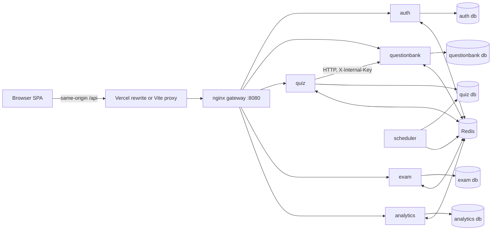
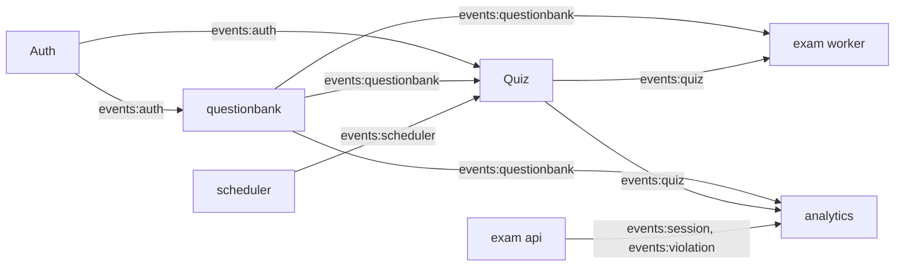
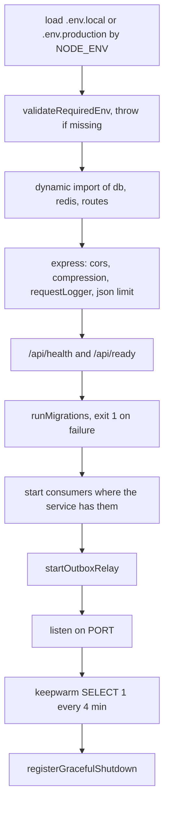

# Architecture

QuizLoom is a quiz platform for a college. Teachers build quizzes from a question bank, students take them through a share link, and teachers watch results live. The backend is six microservices behind one nginx gateway. The frontend is a React SPA hosted separately.

## The pieces

| Piece | What it is | Runs as |
|---|---|---|
| Gateway | nginx, routes `/api/*` to the owning service | `quizloom-gateway`, port 8080 |
| Auth | teachers, admin login, sessions, avatars | `quizloom-auth` |
| Question Bank | subjects, units, bank questions | `quizloom-questionbank` |
| Quiz | quiz authoring, status lifecycle, snapshots | `quizloom-quiz` |
| Exam (API) | student sessions, answers, violations, teacher monitoring | `quizloom-exam` |
| Exam (worker) | event consumers, auto-submit, snapshot writes | `quizloom-exam-worker` |
| Scheduler | polls for due quizzes, emits signals | `quizloom-scheduler` |
| Analytics | read-model projections, dashboards | `quizloom-analytics` |
| Redis | event streams plus cache and locks | `quizloom-redis` |
| Client | React SPA (Vite build) | Vercel |

Every HTTP service listens on port 5000 inside its container. Only the gateway publishes a port.

## Request path



The SPA never calls a service directly. It calls `/api/...` on its own origin, and the edge (Vercel rewrite in production, Vite dev proxy locally) forwards to the gateway. That keeps the session cookie host-only.

## How services talk

Two channels, and only two.

**Synchronous HTTP** is used exactly once: the Quiz service calls the Question Bank's `/internal/questions/select` when auto-generating a quiz, because it needs the questions in the same request.

**Redis Streams** carry everything else. A service writes an event row inside its own database transaction, and a relay publishes it to Redis. See [Events and async processing](./9_events.md).



No service reads another service's tables over the network. Where a service needs foreign data to answer a query, it keeps a local read-model table and fills it from events. That is why `subjects` exists in four databases and `quizzes` exists in three.

## The one deviation

The Scheduler has no database of its own. It connects to the **Quiz service's database** and polls the `quizzes` table for due rows. It only reads, and it only writes to Redis.

Why: the alternative is an internal HTTP endpoint on Quiz polled once a second, which is the same coupling with more moving parts. The cost is that a Quiz schema change to `status`, `scheduled_start`, or `scheduled_end` breaks the Scheduler, and nothing in the code stops that. Worth knowing before you change those columns.

## What every service looks like inside

```text
services/<name>/
├── index.js              boot: env check, migrations, routes, relay, listen
├── Dockerfile
├── .env.example          keys only
├── .env.local            loaded when NODE_ENV is not production
├── .env.production       loaded when NODE_ENV=production
└── src/
    ├── config/           db pool, redis, jwt, cors, migrations, eventBus, outbox
    ├── middleware/       authenticate, authorize, validate, rateLimit, requestLogger, errorHandler
    ├── routes/           express routers
    ├── controllers/      parse request, call service, shape response
    ├── services/         business logic
    ├── repositories/     SQL only
    ├── validators/       zod schemas
    ├── jobs/             stream consumers (where present)
    ├── migrations/       numbered .sql files
    └── utils/            logger, AppError, env, gracefulShutdown, withTransaction
```

Boot order is the same everywhere:



Two health routes, and they mean different things. `/api/health` answers 200 as long as the process is alive. `/api/ready` runs `SELECT 1` and reports Redis status; it answers 503 when the database is unreachable. Analytics is the strict one: it also requires Redis to be ready, because its data only arrives through streams.

The keepwarm ping exists because each service sits on a free-tier Neon database that scales to zero. A `SELECT 1` every four minutes keeps the compute endpoint from cold-starting under a student.

## Repository layout

```text
quiz-platform/
├── client/                React SPA
├── services/
│   ├── auth/  questionbank/  quiz/  exam/  analytics/  scheduler/
├── gateway/nginx.conf
├── docker/redis/          Dockerfile + redis.conf
├── docker-compose.yml     production stack
├── docker-compose.dev.yml overlay pointing services at .env.local
├── scripts/deploy.sh      runs on the server, rolls back on failed health
├── scripts/reset.sh       local rebuild + Redis flush
├── ecosystem.config.cjs   PM2 alternative to Compose, not the deploy path
├── tests/                 integration tests against a live gateway
└── docs/                  this documentation
```

`AGENTS.md` in `.claude/` describes a `packages/` directory and TypeScript sources. Neither exists. The code is plain ESM JavaScript and each service carries its own copy of the shared helpers (logger, env, outbox, event consumer). That duplication is deliberate: it keeps services independently deployable, at the cost of fixing bugs in five places.

## Related documentation

- [API gateway](./2_api_gateway.md)
- [Events and async processing](./9_events.md)
- [Databases](./10_databases.md)
- [Deployment](./12_deployment.md)
