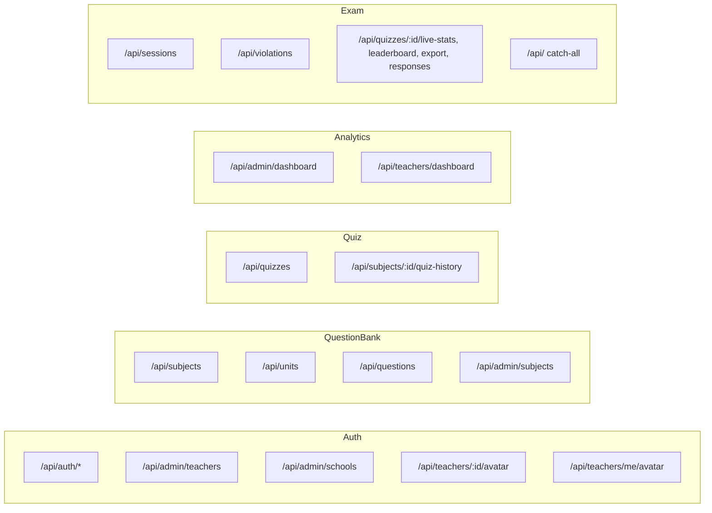
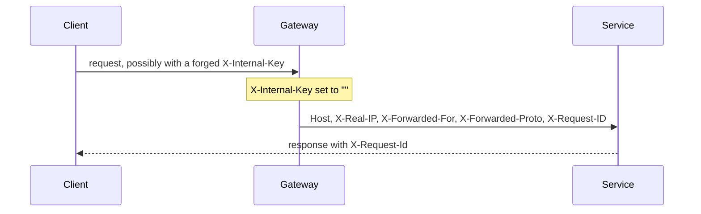

# API Gateway

One nginx server block routes every `/api/*` path to the service that owns it. It is the only backend port exposed to the network. It is defined entirely in `gateway/nginx.conf`.

## What it does

| Job | How |
|---|---|
| Route by path | `location` blocks map a path prefix to a service name |
| Strip the internal key | `proxy_set_header X-Internal-Key ""` on every request |
| Tag requests | `proxy_set_header X-Request-ID $request_id` |
| Allow avatar uploads | `client_max_body_size 3m` (app limit is 2MB) |
| Survive container restarts | Docker DNS resolver plus a per-request `$svc` variable |
| Refuse everything else | `location / { return 404; }` |

## Routing



Order matters, and two pairs of routes only work because of it.

`/api/quizzes` belongs to the Quiz service, but four sub-paths belong to Exam. nginx matches regex locations before prefix locations, so the regex `^/api/quizzes/[^/]+/(live-stats|leaderboard|export|responses)$` wins and everything else under `/api/quizzes` falls through to Quiz.

`/api/subjects` belongs to the Question Bank, but `/api/subjects/:id/quiz-history` belongs to Quiz. Same mechanism.

`/api/teachers/dashboard` (Analytics) is declared before the avatar regexes and above the auth prefixes, so the dashboard path is not swallowed by the teachers routes.

Everything under `/api/` that matches nothing else goes to Exam. That is why `/api/health` reaches Exam's health route.

## Readiness paths

Each service answers its own `/api/ready`, but they all live at the same path inside their container. The gateway gives each one a distinct outside path:

| Gateway path | Proxied to |
|---|---|
| `/api/auth/ready` | `auth:5000/api/ready` |
| `/api/questionbank/ready` | `questionbank:5000/api/ready` |
| `/api/quiz/ready` | `quiz:5000/api/ready` |
| `/api/analytics/ready` | `analytics:5000/api/ready` |
| `/api/exam/ready` | `exam:5000/api/ready` |

The SPA's warmup gate polls all five before it renders the app, and `deploy.sh` checks all five before it calls a deploy healthy. Without the split, both would only ever prove that Exam is up.

## Why `$svc` instead of a fixed upstream

```nginx
resolver 127.0.0.11 valid=10s ipv6=off;
location /api/quizzes { set $svc quiz:5000; proxy_pass http://$svc$request_uri; }
```

nginx resolves a literal `proxy_pass` hostname once, at startup. `docker compose up --build` gives containers new IPs, so a rebuilt service would be unreachable until nginx was reloaded. Putting the target in a variable forces a DNS lookup per request against Docker's internal resolver, with a 10 second cache. Deploys stop needing a gateway reload.

## Header handling



`X-Internal-Key` is blanked on every proxied request, so a client cannot reach an internal endpoint by guessing the header. See [Authentication](./3_authentication.md) for what the key guards.

Services set `app.set("trust proxy", 1)` because there is exactly one hop in front of them. That makes `req.ip` the real client IP, which is what the rate limiters key on.

## What the gateway does not do

- No TLS. In production, TLS terminates in front of the gateway; the compose stack itself serves plain HTTP on 8080.
- No static files. `location /` returns 404. The SPA is served by Vite locally and Vercel in production.
- No auth. Every route is authenticated inside the service that owns it.
- No rate limiting. That also lives in the services.

## Failure cases

| Situation | Result |
|---|---|
| A service container is down | nginx returns 502 for its paths; other services keep serving |
| A service is up but its database is not | `/api/ready` returns 503; the SPA warmup gate keeps polling |
| A path matches nothing | 404 from `location /` |
| An avatar over 3MB | 413 at the gateway, before it reaches the app's 2MB check |

## Related documentation

- [Architecture](./1_architecture.md)
- [Authentication](./3_authentication.md)
- [Deployment](./12_deployment.md)
