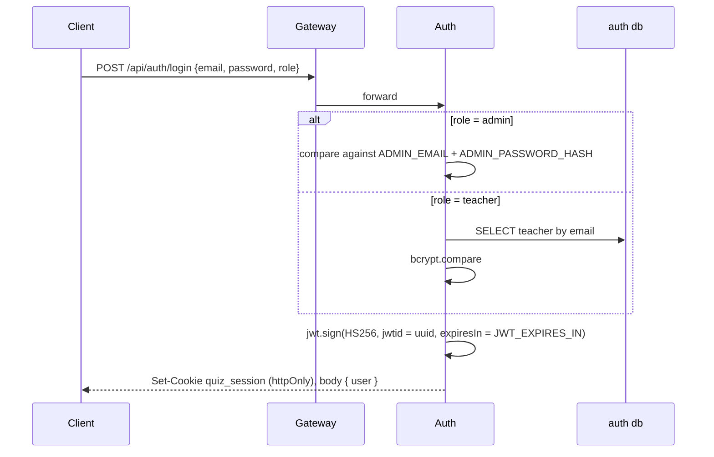
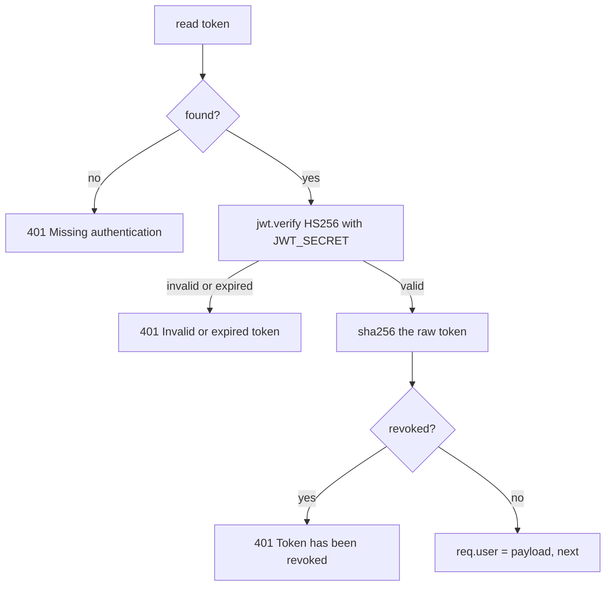
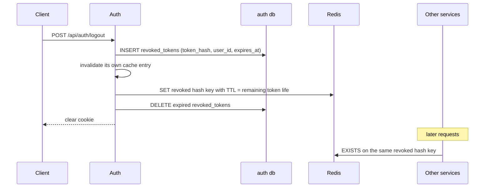
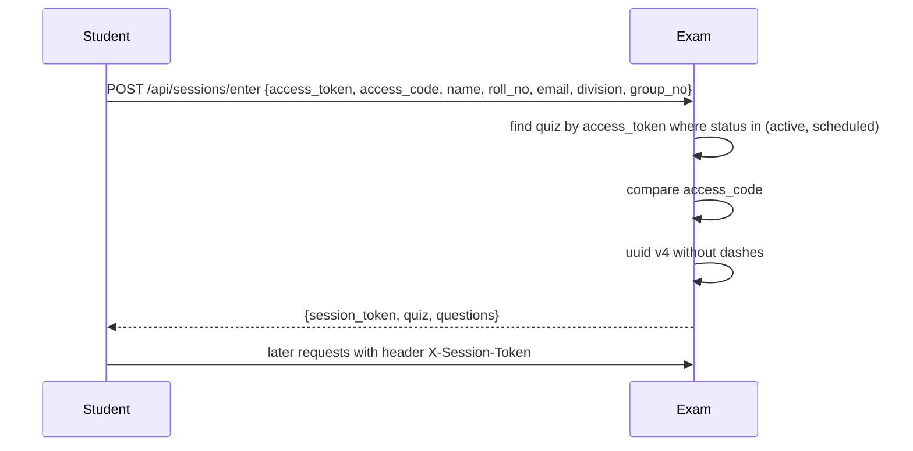

# Authentication and Access Control

Two completely separate identity systems live in this codebase. Staff (teachers and the admin) get a signed JWT in an httpOnly cookie. Students get an opaque session token and never log in at all.

## Responsibilities

| Component | Responsibility |
|---|---|
| `auth` service | Issues tokens, stores teachers, records revocations |
| Every other service | Verifies the token locally, checks the revocation denylist in Redis |
| Gateway | Strips `X-Internal-Key` so only in-cluster callers can set it |
| Exam service | Owns the separate student session token |

## Staff login

The admin is not a database row. It is three environment variables in the auth service: `ADMIN_EMAIL`, `ADMIN_PASSWORD_HASH` (a bcrypt hash), and `ADMIN_NAME`. The admin's token carries `id: 0`. There is one admin, and creating another means changing env and restarting.

Teacher passwords are bcrypt with 12 rounds.

The token payload is `{ id, userId, name, email, role, jti, iat, exp }`. Both `id` and `userId` are present because different services read different ones. `jwtid` is a fresh UUID on every sign, so two logins in the same second cannot produce identical tokens, which matters because revocation is keyed on the token hash and `iat` only has second resolution.

## The session cookie

| Property | Value | Set by |
|---|---|---|
| Name | `quiz_session` | `src/config/cookie.js` |
| httpOnly | always true | code |
| secure | `COOKIE_SECURE === "true"` | env, true in production |
| sameSite | `COOKIE_SAMESITE`, default `lax` | env |
| path | `/` | code |
| maxAge | `COOKIE_MAX_AGE_MS`, default 8h | env |

`SameSite=Lax` works because the SPA reaches the API through its own origin: a Vercel rewrite in production, the Vite dev proxy locally. The browser therefore sees a same-site request. The token is never in `localStorage`; the SPA only stores the user object for instant rendering.

## Verifying a request

Every service carries its own `middleware/authenticate.js`, and they are near-identical.

The token is read from the `quiz_session` cookie first, then from an `Authorization: Bearer` header. `algorithms: ["HS256"]` is pinned on verify, so a token claiming `alg: none` is rejected.

All services share one `JWT_SECRET`. That is what lets any service verify a token without calling Auth.

## Revocation

Logout is the only thing that revokes a token before it expires.

The two sides check differently, on purpose.

**Auth** treats its `revoked_tokens` table as the source of truth and caches the answer under `revoked_cache:<hash>`. A "revoked" answer is cached for `REVOKED_TOKEN_CACHE_TTL_MS` (60s default) because revocation never reverses. A "not revoked" answer is cached for only `REVOKED_TOKEN_NEGATIVE_TTL_MS` (5s default), which bounds how long a just-revoked token can still pass. The cache is Redis first, with a process-local TTL map as fallback so a Redis outage degrades instead of hammering Postgres.

The two prefixes must stay separate. `revoked:<hash>` is the denylist and means "this token is revoked", whatever its value; every other service answers with `EXISTS`. `revoked_cache:<hash>` holds a cached yes-or-no. Caching a "no" under the denylist prefix makes `EXISTS` return 1 and logs the user out of every other service for the length of the negative TTL.

**Every other service** checks Redis only, and treats a Redis failure as "not revoked". That is fail-open by design: if Redis is down, a Postgres round trip on every request across five services would be worse than letting already-issued tokens live out their remaining hours. Tokens still expire on their own.

The Redis TTL equals the token's remaining life, so the denylist cannot grow without bound.

## Roles

`middleware/authorize.js` takes a list of allowed roles and compares `req.user.role`.

| Surface | Required role |
|---|---|
| `/api/admin/*` | `admin` |
| `/api/quizzes`, `/api/questions`, `/api/units` | `teacher` or `admin` |
| `/api/auth/profile`, `/api/auth/change-password` | `teacher` |
| `/api/teachers/dashboard/*` | `teacher` |
| `/api/admin/dashboard/*` | `admin` |
| `/api/sessions/*`, `POST /api/violations` | none, guarded by the session token |

Role is not enough on its own. Ownership is checked per resource in the service layer: a quiz is only visible where `created_by = userId`, a subject only where the teacher created it or is assigned to it. Those checks run against local read-model tables, described in [Databases](./10_databases.md).

## Student sessions

Students never authenticate. They open a share link, type the access code, and get a token back.

The session token is a row key, not a signed claim. It is stored in `student_sessions.session_token` with a unique index, and every later call looks it up. Anyone holding the token holds that student's session; there is nothing else tying it to a person.

Two consequences worth knowing. Nothing stops one student entering twice and creating two sessions. Nothing stops a shared access code being used by someone outside the class. The access code plus a bounded quiz window is the whole control.

## Rate limits

Fixed-window counters, in Redis when it is up (`rate_limit:*` keys, shared across instances), in a per-process map when it is not.

| Route | Window | Max | Key |
|---|---|---|---|
| `POST /api/auth/register`, `/api/auth/login` | 15 min | 20 | client IP |
| `POST /api/sessions/enter` | 5 min | 30 | IP + access token |
| `PATCH /api/sessions/progress`, `/api/sessions/answers/:id` | 10 s | 12 | session token or IP |
| `POST /api/sessions/submit` | 1 min | 6 | session token or IP |
| `POST /api/violations` | 1 min | 20 | session token or IP |

`RATE_LIMIT_DISABLED=true` switches limiting off for load tests, and is **ignored when `NODE_ENV=production`** with a warning logged at boot. Login brute-force protection cannot be turned off in production by env alone.

## Service-to-service authentication

The Quiz service calls the Question Bank's `/internal/questions/select` with an `X-Internal-Key` header. The Question Bank rejects the request with 403 unless the header matches its own `INTERNAL_KEY`. Both services must be configured with the same value.

That is only safe because the gateway blanks the header on every external request. There is no second factor: anything already inside the Docker network with the key can call the internal route.

## Other security behavior in the code

| Control | Where |
|---|---|
| Every query parameterised, no string-built SQL | all repositories |
| Zod validation before logic or SQL | `middleware/validate.js` + `validators/` |
| Secrets from env only, `.env*` gitignored except `.env.example` | `.gitignore` |
| Env validated at boot, process throws when a required key is missing | `utils/env.js` |
| CORS allowlist from `CLIENT_URLS`, no fallback | `config/cors.js` |
| Sensitive keys redacted in logs (tokens, passwords, access codes) | `utils/logger.js` |
| Statement timeout on every pooled connection (15s default) | `config/db.js` |
| JSON body limit 256kb, avatar upload capped at 2MB and 3 mime types | `index.js`, `routes/teachers.routes.js` |
| Error responses carry a message only, never a stack | `middleware/errorHandler.js` |

One thing to flag rather than hide: the `teachers` table has a `plain_password` column, and `GET /api/admin/teachers/:id/credentials` returns it to the admin. It exists so an admin can re-read the password they set for a teacher. It is a real weakening of the password store, and it is admin-only.

## Failure cases

| Situation | Behavior |
|---|---|
| Redis down, staff request | Revocation check returns false; valid tokens keep working, logged-out tokens work until they expire |
| Redis down, rate limiting | Falls back to per-process in-memory counters, so limits are per instance |
| `JWT_SECRET` differs between services | Tokens issued by Auth fail verification elsewhere with 401 |
| `CLIENT_URLS` unset | Service refuses to start |
| Auth database down | Login fails; other services still verify tokens, since verification needs no database |

## Related documentation

- [API gateway](./2_api_gateway.md)
- [Exam](./6_exam.md)
- [Databases](./10_databases.md)
