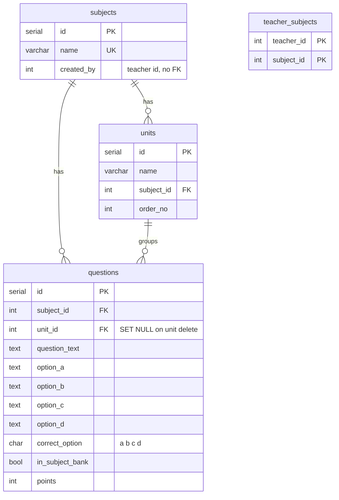
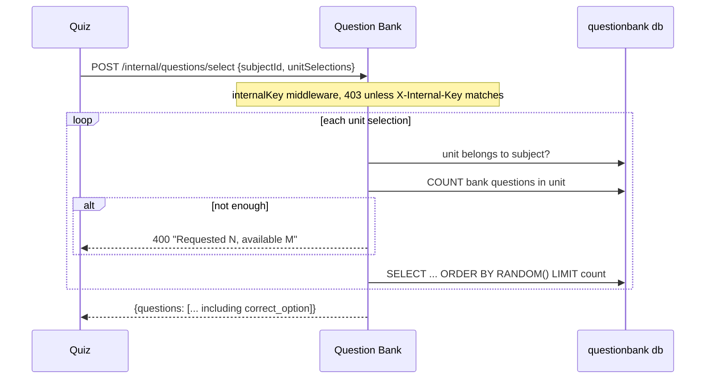

# Question Bank

Owns the teaching content: subjects, the units inside them, and the questions. It is the only service that stores reusable questions. Everything else either copies them or projects a thin read-model of subjects.

## Responsibilities

| Component | Responsibility |
|---|---|
| `subjects` | Named subject, created by an admin or a teacher |
| `units` | Ordered chapters inside a subject |
| `questions` | MCQ rows, optionally marked as bank questions |
| `teacher_subjects` | Local read-model of who may access which subject, fed by auth events |
| `/internal/questions/select` | Random bank questions for the Quiz service's auto-generate |

## Data model

`created_by` is a plain integer. Teachers live in the auth service's database, so there is no foreign key across the boundary.

`in_subject_bank` is the flag that separates a reusable bank question from a one-off. Only rows with `in_subject_bank = TRUE` can be picked by auto-generate.

## Who can see what

Two different rules, and they are genuinely different:

- **Listing subjects** (`GET /api/subjects`): an admin sees every subject. A teacher sees only subjects joined through `teacher_subjects`, meaning subjects an admin assigned to them.
- **Acting on a subject** (creating a question, listing units): the teacher passes if they created the subject **or** are assigned to it.

So a teacher who creates a subject can immediately add questions to it, but will not see it in their own subject list until an admin assigns it. That is how the code behaves today.

Deleting a subject is admin-only. Creating one is admin-only through the route, though the service still handles the teacher case (`created_by` set to the teacher, null for an admin).

## API

| Method | Endpoint | Purpose | Auth |
|---|---|---|---|
| GET | `/api/subjects` | List subjects visible to the caller | teacher, admin |
| POST | `/api/subjects` | Create a subject | admin |
| DELETE | `/api/subjects/:id` | Delete a subject | admin |
| GET | `/api/subjects/:id/units` | Units with question counts | teacher, admin |
| POST | `/api/subjects/:id/units` | Create a unit | teacher, admin |
| PUT | `/api/subjects/:id/units/:unitId` | Rename a unit | teacher, admin |
| DELETE | `/api/subjects/:id/units/:unitId` | Delete a unit | teacher, admin |
| PUT | `/api/units/:id` | Rename a unit | teacher, admin |
| DELETE | `/api/units/:id` | Delete a unit | teacher, admin |
| GET | `/api/units/:id/questions` | Paged bank questions in a unit | teacher, admin |
| GET | `/api/questions?subject_id=` | Paged questions, filterable by unit, search, bank flag | teacher, admin |
| POST | `/api/questions` | Create one question | teacher, admin |
| POST | `/api/questions/bulk-import` | Create many (Excel import path) | teacher, admin |
| PUT | `/api/questions/:id` | Update a question | teacher, admin |
| DELETE | `/api/questions/:id` | Delete a question | teacher, admin |
| GET | `/api/admin/subjects` | All subjects with counts | admin |
| GET | `/api/admin/subjects/:id/questions` | All questions in a subject | admin |
| POST | `/internal/questions/select` | Random bank questions | internal key |

Question update and delete are scoped by `created_by` in SQL, so one teacher cannot edit another's question even inside a shared subject.

## Bulk import

`POST /api/questions/bulk-import` takes `{ subject_id, questions: [...] }` and inserts them one row at a time in a loop, outside a transaction. A failure halfway leaves the earlier rows inserted. The client parses the spreadsheet (`client/src/utils/excelParser.js`) and sends parsed rows; the server never sees a file.

## The internal selection endpoint

This is the only synchronous call between two services in the whole system.

The response includes `correct_option`, because the Quiz service copies the full question into its own tables.

`ORDER BY RANDOM()` is a full scan of the unit's bank questions. Fine at this size; the first thing to change if a unit ever holds tens of thousands of rows.

Quiz surfaces the Bank's 400s to the teacher unchanged, so "Not enough questions in Unit 3" reaches the UI as written. Anything else becomes a 502, and an unreachable Bank becomes a 503.

## Events

Published on `events:questionbank` through the transactional outbox:

| Event | When | Consumed by |
|---|---|---|
| `subject.upserted` | Subject created | quiz, exam worker, analytics |
| `subject.deleted` | Subject deleted | quiz, exam worker, analytics |

Consumed from `events:auth`, into the local `teacher_subjects` table:

| Event | Effect |
|---|---|
| `teacher_subjects.assigned` | Insert the pair |
| `teacher_subjects.removed` | Delete the pair |
| `teacher.deleted` | Delete every pair for that teacher |

Note what is **not** published: nothing about units or questions. Downstream services never need question content from the Bank, because Quiz copies it at creation time.

## Failure cases

| Situation | Behavior |
|---|---|
| Delete a subject that a question references | Cascade deletes its units and questions inside this database |
| Delete a subject still referenced elsewhere | 409 if Postgres raises a foreign-key violation |
| Delete a unit | Its questions have `unit_id` set to null and survive |
| Duplicate subject name | 409 |
| Duplicate unit name in one subject | 400 |
| Auth events not flowing | Teacher subject lists go stale; the fix is fixing the stream, not writing to this table |

## Related documentation

- [Quiz](./5_quiz.md)
- [Events and async processing](./9_events.md)
- [Databases](./10_databases.md)
