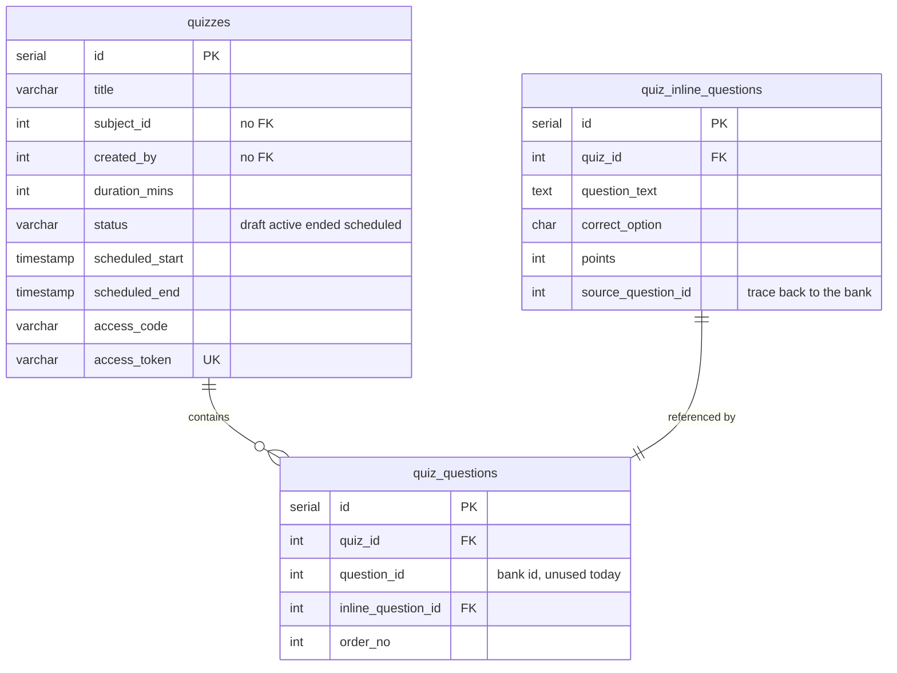
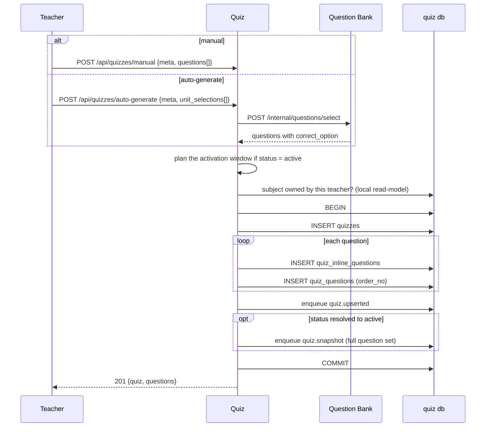
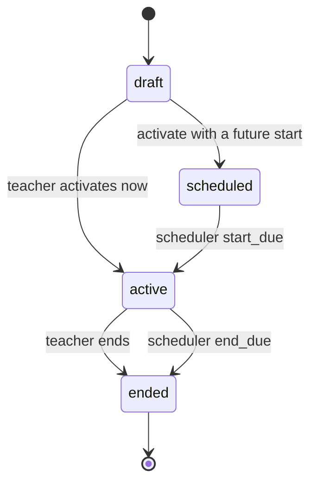

# Quiz

Owns quiz authoring and the quiz lifecycle. A quiz is created as a draft, activated (immediately or on a schedule), and ended. Quiz never touches student data: it announces state changes and lets the Exam service react.

## Responsibilities

| Component | Responsibility |
|---|---|
| `quizzes` | Quiz metadata, status, schedule window, access code and token |
| `quiz_inline_questions` | The quiz's own copy of every question |
| `quiz_questions` | Ordered membership rows linking a quiz to its questions |
| `quizLifecycle.service` | The status state machine |
| `quizTiming.service` | Parses and stores India wall-clock timestamps |
| `quizSnapshot.service` | Builds the question set that students will see |
| `subjects`, `teacher_subjects` | Read-models used only for subject authorization |

## Data model

Every question in a quiz is a **copy**, stored in `quiz_inline_questions`. A question generated from the bank keeps `source_question_id` as a breadcrumb, and nothing more. Editing or deleting the bank question afterwards cannot change a quiz that has already been built, which is the point: a quiz taken last term must still show what students actually saw.

`quiz_questions` has a check constraint enforcing that a membership row points at a bank question **or** an inline question, never both. Both creation paths currently write the inline side, so `question_id` is always null in practice.

Question identity used everywhere downstream (answers, scoring, the student UI) is the **`quiz_questions.id`**, not the inline question id and not the bank id.

## Creating a quiz

Two entry points, one shared shape.

The whole create is one transaction, and the events go into the same transaction through the outbox table. A crash after commit still delivers the events; a crash before commit delivers nothing and leaves no quiz.

The manual payload accepts `unit_id`, `new_unit_name`, and `in_subject_bank` on each question, but the insert ignores all three. Manual questions are **not** written back to the question bank. If you need that, it does not exist yet.

## Status lifecycle

`transitionQuizStatus` allows exactly three moves: `draft -> active`, `scheduled -> active`, `active -> ended`. Anything else returns an error, which is also what makes duplicate scheduler signals harmless: the second one finds a quiz already in the target state and rolls back to a no-op.

Requesting `active` with a future `scheduled_start` persists `scheduled` instead. That single rule is why the API only has to expose "activate" and "end".

Side effects of the transition, all inside the same UPDATE:

- Activating without an access token generates one, an 8-byte hex string. Activating without an access code is an error.
- Activating with no `scheduled_start` stamps now.
- Activating with no `scheduled_end` stamps now plus `duration_mins`.
- Ending pulls `scheduled_end` back to now if it was still in the future.

`PUT /api/quizzes/:id/status` accepts only `active` or `ended`. There is no route back to draft.

## Time is India wall-clock

`scheduled_start` and `scheduled_end` are `timestamp without time zone`, holding India local time. `quizTiming.service.js` parses a `datetime-local` value with no timezone suffix as IST, and every SQL comparison uses `NOW() AT TIME ZONE 'Asia/Kolkata'`.

This is a deliberate single-timezone choice. It keeps what the teacher typed identical to what is stored, with no conversion to reason about. It also means the platform cannot serve two timezones without a migration of both the columns and every query that mentions `Asia/Kolkata`.

Validation: end must be later than start, or the request is a 400.

## Snapshots

A snapshot is the full question set for a quiz, including `correct_option`, published as a `quiz.snapshot` event. Quiz builds it; the Exam service stores it and serves it. Quiz never stores a snapshot itself.

Snapshots are enqueued at four moments:

| Trigger | Why |
|---|---|
| Create resolved to active | Students may arrive immediately |
| Status flips to active | Same |
| Edit while active | A teacher edit must not leave students on stale questions |
| `quiz.prewarm_due` from the scheduler | Warm the cache a couple of minutes before start, so the entry spike does not hit Postgres |

## Editing a quiz

`PUT /api/quizzes/:id` patches metadata, and can reorder questions by sending `question_ids` in the new order. The reorder is validated: the supplied ids must be exactly the quiz's current membership ids, no more and no fewer, or the request is a 400. If the quiz is active, a fresh snapshot is enqueued.

`POST /api/quizzes/:id/duplicate` copies the quiz row and its questions into a new draft titled `Copy of ...`.

## API

| Method | Endpoint | Purpose | Auth |
|---|---|---|---|
| GET | `/api/quizzes` | Paged list, filter by status and search | teacher, admin |
| GET | `/api/quizzes/:id` | Quiz with its questions (answers included) | owner |
| GET | `/api/quizzes/:id/preview` | Quiz with questions, preview shape | owner |
| POST | `/api/quizzes/manual` | Create from typed questions | teacher, admin |
| POST | `/api/quizzes/auto-generate` | Create from bank units | teacher, admin |
| POST | `/api/quizzes/:id/duplicate` | Copy into a new draft | owner |
| PUT | `/api/quizzes/:id` | Update metadata or reorder | owner |
| PUT | `/api/quizzes/:id/status` | `active` or `ended` | owner |
| DELETE | `/api/quizzes/:id` | Delete quiz and its questions | owner |
| GET | `/api/subjects/:id/quiz-history` | Quizzes for a subject, with questions | teacher who created the subject, or admin |

"Owner" means the SQL carries `AND created_by = $userId`. A non-owner gets 404, not 403, so quiz ids are not enumerable.

Responses that change the share link include `share_url`, built as `${CLIENT_URL}/quiz/enter/${access_token}`.

## Events

Published on `events:quiz`:

| Event | Payload | Consumed by |
|---|---|---|
| `quiz.upserted` | Full quiz metadata row | exam worker, analytics |
| `quiz.snapshot` | `{quizId, questions[]}` with correct answers | exam worker |
| `quiz.ended` | `{quizId}` | exam worker, which then auto-submits |
| `quiz.deleted` | `{quizId}` | exam worker, analytics, both clean up |

Consumed:

| Stream | Events | Effect |
|---|---|---|
| `events:questionbank` | `subject.upserted`, `subject.deleted` | Maintain the local `subjects` read-model |
| `events:auth` | `teacher_subjects.assigned/removed`, `teacher.deleted` | Maintain the local `teacher_subjects` read-model |
| `events:scheduler` | `quiz.start_due`, `quiz.end_due`, `quiz.prewarm_due` | Flip status, enqueue a snapshot |

## Why Quiz does not auto-submit

Ending a quiz has to finalise every unsubmitted student session. Quiz could do it, but student sessions are Exam's tables, and reaching across would break the rule that keeps the databases separable.

So the transition commits, `quiz.ended` goes out, and the Exam worker finalises in batches. The trade is that "ended" and "all sessions scored" are not the same instant: there is a lag of roughly the relay interval plus the batch time. The status change is what students see immediately, and it is what closes the write path, so the lag is invisible to them.

## Failure cases

| Situation | Behavior |
|---|---|
| Activate without an access code | 400 |
| Scheduled end at or before start | 400 |
| Question bank unreachable during auto-generate | 503, nothing is created |
| Duplicate scheduler signal | Invalid transition, transaction rolls back, no-op |
| Redis down | Events pile up in `outbox_events` and drain when it returns |
| Reorder ids do not match the quiz | 400 before any write |

## Related documentation

- [Question Bank](./4_question_bank.md)
- [Exam](./6_exam.md)
- [Scheduler](./7_scheduler.md)
- [Events and async processing](./9_events.md)
