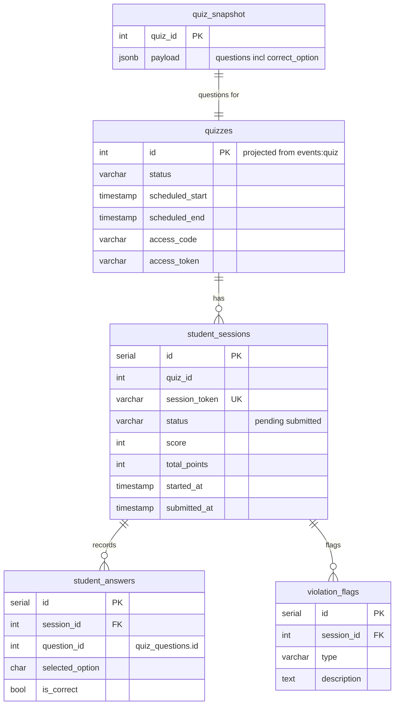
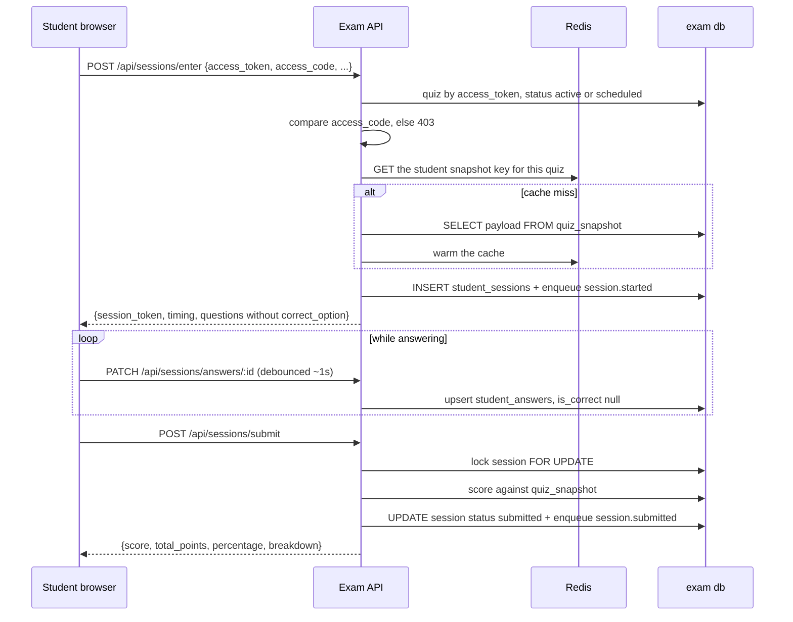
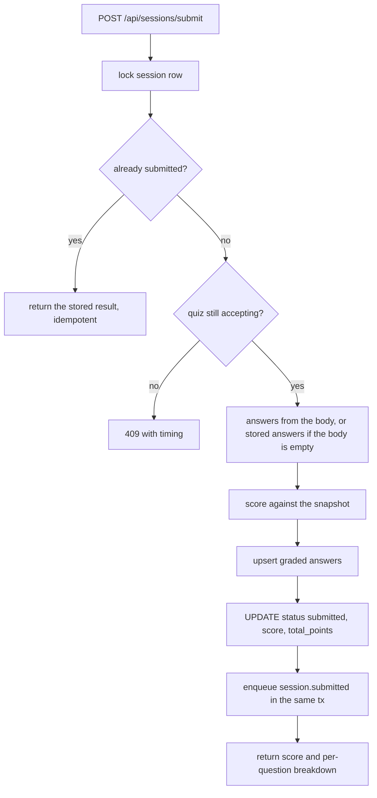
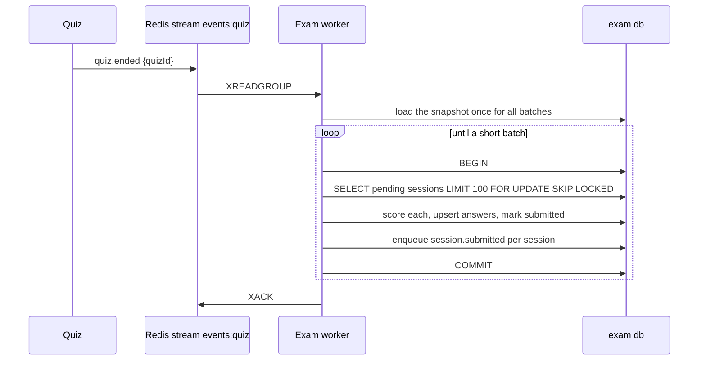

# Exam

Runs the student side of a quiz and the teacher's live view of it. It is the only service that stores student sessions, answers and violations. It holds no question content of its own: every question it serves comes from a snapshot published by the Quiz service.

It ships as two processes from one image.

| Process | Command | Owns |
|---|---|---|
| API | `node index.js` | Student HTTP routes, teacher monitoring routes |
| Worker | `node worker.js` | Stream consumers, auto-submit, snapshot writes, cleanup |

The worker exists because ending a quiz can mean scoring hundreds of sessions. That work must not compete with student submits on the API process, and it must keep running even if the API is restarting.

## Data model

`quizzes` and `subjects` here are read-models, filled by the worker from `events:quiz` and `events:questionbank`. They are never written by a request.

`student_answers` has a unique index on `(session_id, question_id)`, which is what makes answer saving an upsert rather than an append.

## The student journey

Three things about that flow are worth calling out.

**Questions come from Redis first.** The snapshot key is `quiz:<id>:student_snapshot`, holding the student-safe questions with `correct_option` stripped, TTL four hours. A whole class entering at 10:00 hits Redis, not Postgres. The durable `quiz_snapshot` row is the fallback and backfills the cache on a miss.

**Correct answers never reach the browser during the quiz.** `sanitizeQuestions` removes `correct_option` before anything is cached for students or returned by `/enter`. The full set with answers stays in the `quiz_snapshot` row, which is what scoring reads.

**Scoring reads the snapshot, not the quiz tables.** `jsonb_to_recordset` expands the snapshot payload into rows. Exam never queries the Quiz service's database, and a quiz edited after a student started still scores against what was captured.

## Saving answers

The browser debounces about one second, then sends either a single answer (`PATCH /api/sessions/answers/:questionId`) or a batch (`PATCH /api/sessions/progress`). Both land in the same upsert, with `is_correct` left null: progress saves are not graded.

The write path takes `FOR UPDATE` on the session row and checks the quiz window first:

| Window phase | Result |
|---|---|
| `scheduled` | 409 "Quiz has not started yet" plus timing payload |
| `active` | Saved |
| `ended` | 409 "Quiz has ended", `session_closed: true` |

If the session is already submitted, the save returns the final result instead of an error, so a late in-flight request from a closing tab resolves cleanly.

Answers are also mirrored into `sessionStorage` on the client, so a mid-quiz reload restores the student's selections. See [Frontend](./11_frontend.md).

## Submitting

Scoring is plain: `total_points` is the sum of every question's points, and a question scores if the selected option equals `correct_option`. An unanswered question counts as wrong. There is no negative marking and no partial credit, even though `allow_multiple_answers` exists as a column.

Submitting is idempotent through two mechanisms: the row lock plus the `status = submitted` early return, and an optional client-supplied `submission_id` stored on the row.

## Auto-submit when a quiz ends

Nothing in the Exam service watches the clock. It reacts to `quiz.ended`.

One transaction per batch of 100 (`AUTO_SUBMIT_BATCH_SIZE`), so locks release between batches and several workers can share the work through `SKIP LOCKED`. The loop stops when a batch comes back short, meaning nothing pending is reachable.

The consumer acks only after the handler returns. A crash mid-way leaves the event pending, it gets reclaimed, and the rerun finds fewer pending sessions and finishes the rest. Idempotent by construction.

## Proctoring

The browser watches for six things and posts each to `POST /api/violations` with the session token. The client rate-limits itself to one report per type per three seconds; the server adds its own limit of 20 per minute.

| Type | Trigger |
|---|---|
| `tab_switch` | `visibilitychange` to hidden |
| `window_blur` | window loses focus |
| `screenshot_attempt` | PrintScreen, or Cmd+Shift+3/4/5 |
| `copy_shortcut` | Ctrl/Cmd+C, also prevented |
| `copy_event` | copy event, also prevented |
| `context_menu` | right click, also prevented |

Each accepted report inserts a `violation_flags` row and enqueues `violation.flagged` for Analytics. Violations do not affect the score and do not end the session; they are evidence for the teacher.

Reports are rejected once the session is no longer `pending`.

## Teacher monitoring

| Method | Endpoint | Purpose | Auth |
|---|---|---|---|
| GET | `/api/quizzes/:id/live-stats` | Entered, submitted, pending, flagged, elapsed | quiz owner |
| GET | `/api/quizzes/:id/leaderboard` | Top 10 by score, then time taken | quiz owner |
| GET | `/api/quizzes/:id/responses` | Paged per-student rows with violation counts | quiz owner |
| GET | `/api/quizzes/:id/export` | XLSX of every student's result | quiz owner |
| GET | `/api/violations?session_id=` | One session's answers and violations | teacher |

Ownership is `created_by = userId` on the local `quizzes` read-model, which is why the projection has to be working for a teacher to see their own live stats.

Live stats are cached for three seconds (`LIVE_STATS_TTL_MS`), keyed by quiz and teacher. The teacher UI polls every five seconds and several teachers may watch the same quiz, so the cache stops each poll re-running three aggregates. Redis when available, a process-local TTL map otherwise.

Export builds an XLSX in memory with `exceljs` and streams it back. Rows are sorted by roll number using natural alphanumeric ordering, so `2` comes before `10`.

## Student-facing routes

| Method | Endpoint | Purpose | Auth |
|---|---|---|---|
| POST | `/api/sessions/enter` | Start a session | access token + code |
| GET | `/api/sessions/timing` | Server clock and quiz phase | `X-Session-Token` |
| GET | `/api/sessions/result` | Result after submit | `X-Session-Token` |
| PATCH | `/api/sessions/answers/:questionId` | Save one answer | `X-Session-Token` |
| PATCH or POST | `/api/sessions/progress` | Save a batch | `X-Session-Token` |
| POST | `/api/sessions/submit` | Submit and score | `X-Session-Token` |
| POST | `/api/violations` | Report a violation | `X-Session-Token` |

Every response that involves timing carries `server_now`, `start_time`, `end_time`, `quiz_state` and the remaining seconds. The client trusts the server clock and stores the offset, so a student with a wrong device clock still gets the right countdown.

## Events

Published (streams keyed by the event prefix):

| Event | Stream | Consumed by |
|---|---|---|
| `session.started` | `events:session` | analytics |
| `session.submitted` | `events:session` | analytics |
| `violation.flagged` | `events:violation` | analytics |

Consumed by the worker:

| Event | Effect |
|---|---|
| `quiz.upserted` | Upsert the local `quizzes` row |
| `quiz.snapshot` | Write `quiz_snapshot`, warm the Redis student cache |
| `quiz.ended` | Auto-submit every pending session |
| `quiz.deleted` | Delete violations, answers, sessions, quiz row, and the snapshot |
| `subject.upserted` / `subject.deleted` | Maintain the local `subjects` read-model |

## Failure cases

| Situation | Behavior |
|---|---|
| Redis down at entry | Snapshot read falls back to `quiz_snapshot` in Postgres; entry still works |
| Snapshot missing entirely | `/enter` returns 400 "Quiz has no questions configured" |
| Student submits after the window closed | 409 with `session_closed`, and the quiz-ended path will have scored them anyway |
| Two submits at once | Row lock serialises them; the second returns the stored result |
| Worker down when a quiz ends | The event stays pending and is processed when the worker returns |
| Worker crashes mid auto-submit | Committed batches stand, the event is reclaimed and the rest finish |

## Related documentation

- [Quiz](./5_quiz.md)
- [Analytics](./8_analytics.md)
- [Events and async processing](./9_events.md)
- [Frontend](./11_frontend.md)
