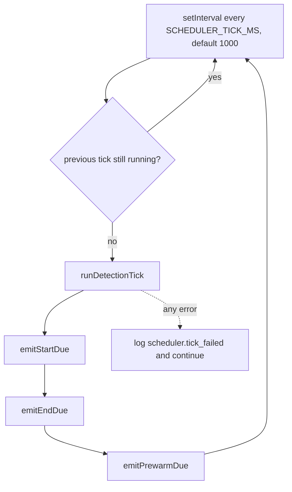
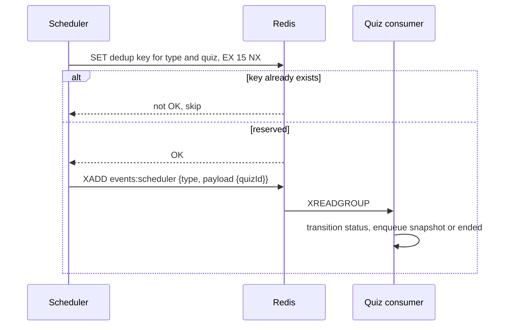

# Scheduler

A single process with one job: notice when a quiz is due to start, due to end, or about to start, and put a signal on a Redis stream. It changes no quiz state itself.

It is the smallest service in the repo: 281 lines across 8 files.

## How it runs

An `inFlight` flag stops ticks overlapping when a pass runs long. Errors are caught inside the tick, so one bad pass never kills the loop.

## The three queries

All three run against the **Quiz service's database**, comparing to `NOW() AT TIME ZONE 'Asia/Kolkata'` because that is how quiz timestamps are stored.

| Signal | Condition |
|---|---|
| `quiz.start_due` | `status = 'scheduled'` and `scheduled_start <= now` |
| `quiz.end_due` | `status = 'active'` and `scheduled_end <= now` |
| `quiz.prewarm_due` | `status = 'scheduled'` and `scheduled_start` within the next `QUIZ_PREWARM_WINDOW_MINUTES` (default 2) |

Prewarm is the interesting one. It fires a couple of minutes before a quiz opens and makes the Quiz service publish a snapshot early, so the Exam service has the questions in Redis before the class arrives. The first student then hits a warm cache instead of a cold Postgres read.

## Publishing, and not publishing twice

`SET ... NX` with a TTL is the whole dedup mechanism. The scheduler ticks every second, and a quiz stays "due" until its status changes, so without dedup one late quiz would emit a signal per second. The key holds for `SCHEDULER_DEDUP_TTL_SECONDS` (15s), prewarm for `SCHEDULER_PREWARM_DEDUP_SECONDS` (60s).

The TTL is also the retry. If the Quiz consumer is down or fails, the key expires, the quiz is still due on the next tick, and the signal goes out again.

## What the Quiz service does with a signal

| Signal | Reaction |
|---|---|
| `quiz.start_due` | Transition to `active`; if it really became active, enqueue `quiz.upserted` and `quiz.snapshot` |
| `quiz.end_due` | Transition to `ended`, enqueue `quiz.upserted` and `quiz.ended` |
| `quiz.prewarm_due` | Enqueue `quiz.snapshot` only, no status change |

Each transition runs in its own transaction with the strict state machine enforced. A duplicate signal produces an invalid transition, the transaction rolls back, and nothing happens. That is what makes at-least-once delivery safe here.

Auto-submit is not in this list. Ending a quiz emits `quiz.ended`, and the Exam worker finalises the sessions. See [Exam](./6_exam.md).

## Why a signal instead of doing the work

The scheduler could open the quiz database and flip the status itself. It does not, for three reasons.

The status change has side effects that belong to the Quiz service: generating an access token, stamping the schedule window, building a snapshot, publishing lifecycle events. Duplicating that logic in a second process means it drifts.

The work is unbounded. Ending a quiz can mean scoring hundreds of sessions. A one-second tick loop cannot own work that takes minutes.

And a stream gives the retry semantics for free: an unhandled signal stays visible, gets redelivered, and the dedup TTL controls the rate.

The cost is a delay of up to one tick plus the consumer's read latency. For a quiz window measured in minutes, that is invisible.

## The direct database read

The scheduler is configured with the Quiz service's `DATABASE_URL`. It only ever reads, and it only writes to Redis. It has no migrations and owns no tables.

This breaks the "no service reads another service's database" rule, and it is the only place in the system that does. The alternative was an internal HTTP endpoint on Quiz, polled every second, which is the same coupling with more failure modes. The real risk is silent: renaming or retyping `status`, `scheduled_start` or `scheduled_end` in the Quiz service breaks detection, and nothing in the Quiz repo points at this dependency.

## Configuration

| Variable | Default | Meaning |
|---|---|---|
| `DATABASE_URL` | required | The Quiz service's database |
| `REDIS_URL` | required in practice | Without it, detection has nowhere to publish |
| `SCHEDULER_TICK_MS` | 1000 | Detection interval |
| `QUIZ_PREWARM_WINDOW_MINUTES` | 2 | How early to warm a snapshot |
| `SCHEDULER_DEDUP_TTL_SECONDS` | 15 | Start and end dedup window |
| `SCHEDULER_PREWARM_DEDUP_SECONDS` | 60 | Prewarm dedup window |
| `EVENT_STREAM_MAXLEN` | 10000 | Approximate stream cap |

Only `DATABASE_URL` is checked at startup. A missing `REDIS_URL` logs an error and the process keeps ticking, publishing nothing.

## Failure cases

| Situation | Behavior |
|---|---|
| Redis down | `publishDueOnce` returns false, nothing is emitted; quizzes stay due and fire when Redis returns |
| Quiz database down | Tick logs a warning and retries next second |
| Scheduler process down | Nothing starts or ends on schedule; teachers can still activate and end by hand |
| Two scheduler instances | The `SET NX` reservation makes the second one a no-op |
| A tick runs long | The `inFlight` guard skips the next tick rather than stacking |

## Related documentation

- [Quiz](./5_quiz.md)
- [Exam](./6_exam.md)
- [Events and async processing](./9_events.md)
