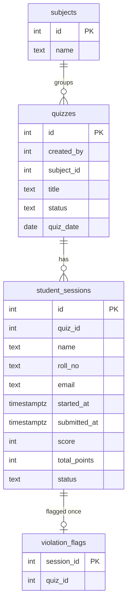
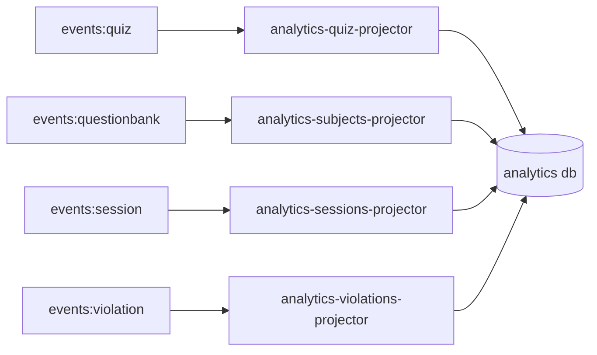
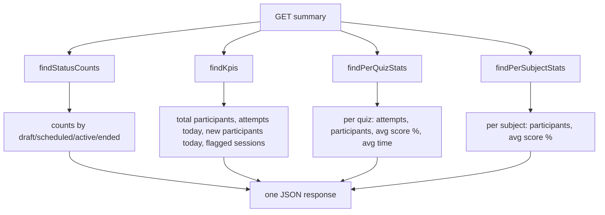

# Analytics

Serves the teacher and admin dashboards. It owns no source data at all. Every table in its database is a projection rebuilt from events, and every request is a read.

## Responsibilities

| Component | Responsibility |
|---|---|
| `projectionConsumer` | Four stream consumers keeping the read-model current |
| `dashboard.repository` | The aggregate SQL behind every KPI and table |
| `dashboard.service` | Shapes the payload, clamps the trend date range |

## Read-model



Deliberately thin. No answers, no questions, no snapshot. `violation_flags` keyed by `session_id` records only *that* a session was flagged, not how many times, which is all the dashboard shows.

No foreign keys anywhere. Events arrive out of order, so `session.submitted` for a quiz can land before `quiz.upserted` for it, and a foreign key would reject the row that arrived first.

## Projection



Four independent consumer groups, each on its own Redis connection, all started by `startProjectionConsumer()` in the API process. There is no separate worker.

| Event | Effect |
|---|---|
| `quiz.upserted` | Upsert the quiz row |
| `quiz.deleted` | Delete violations, sessions, then the quiz |
| `subject.upserted` / `subject.deleted` | Upsert or delete the subject |
| `session.started` | Insert the session with status `pending` |
| `session.submitted` | Upsert score, total points, submitted time, status `submitted` |
| `violation.flagged` | Insert the flag, `ON CONFLICT DO NOTHING` |

Every write is an upsert. That is what makes redelivery and out-of-order arrival safe: `session.submitted` landing before `session.started` inserts the row with its scores, and the later `started` event fills in the identity columns without clearing them, because the two statements touch different columns.

Because the whole database is derived, it can be rebuilt: flush the consumer groups and let them replay from the start of each stream. Groups are created at offset `0`, not `$`, precisely so a fresh group replays what is already there. The limit is stream retention: `MAXLEN ~ 10000` per stream, so a rebuild only recovers the last 10k events per stream, not all history.

## Dashboards

Two role-scoped surfaces over the same code. `createdBy` is the teacher's id for teachers and `null` for the admin; every query carries `WHERE ($1::int IS NULL OR created_by = $1)`.

| Method | Endpoint | Purpose | Auth |
|---|---|---|---|
| GET | `/api/teachers/dashboard/summary` | Counts, KPIs, per-quiz and per-subject stats | teacher |
| GET | `/api/teachers/dashboard/trend?start=&end=` | Daily participant counts | teacher |
| GET | `/api/admin/dashboard/summary` | Same, unscoped | admin |
| GET | `/api/admin/dashboard/trend?start=&end=` | Same, unscoped | admin |

`summary` runs four aggregates in parallel and returns one payload:



The aggregation is entirely in SQL. It used to be done in the browser; moving it here is why `002_dashboard_indexes.sql` adds indexes on `started_at` and `(quiz_id, started_at)`.

## Counting a participant

Students have no accounts, so "participant" is a derived identity:

```sql
lower(coalesce(
  nullif(btrim(email), ''),
  nullif(btrim(roll_no), ''),
  nullif(btrim(name), ''),
  'session:' || id::text
))
```

Email first, then roll number, then name, then the session id as a last resort. Two attempts by the same email count as one participant and two attempts. A student who types their email differently across quizzes counts twice. That imprecision is accepted; the alternative is student accounts.

## Trend range

`getParticipantTrend` clamps whatever the client sends:

- Missing or unparseable `end` becomes now.
- Missing or unparseable `start` becomes 29 days before the end.
- A start after the end resets to the 29-day default.
- A range longer than 366 days is pulled back to 366.
- The end is extended to 23:59:59.999 so the final day is whole.

Without the clamp, a crafted range could scan the entire table. The response is sparse: days with no sessions are absent, and the client draws the continuous axis.

## Readiness

Analytics is the only service whose `/api/ready` requires **both** the database and Redis. Its data only arrives over streams, so a healthy database with a dead Redis means a dashboard that is quietly going stale. Reporting unavailable is more honest, and the SPA warmup gate waits for it.

## Failure cases

| Situation | Behavior |
|---|---|
| A projection handler throws | The entry is not acked, gets reclaimed, retried up to 5 times, then dead-lettered |
| An event never arrives | The dashboard silently under-reports; nothing detects the gap |
| Redis down | Readiness is 503; existing rows still serve, new data stops arriving |
| Stream trimmed past what a group consumed | Those events are lost and a rebuild cannot recover them |
| A quiz deleted | Cascade removes its sessions and flags from the read-model |

## Related documentation

- [Events and async processing](./9_events.md)
- [Exam](./6_exam.md)
- [Databases](./10_databases.md)
