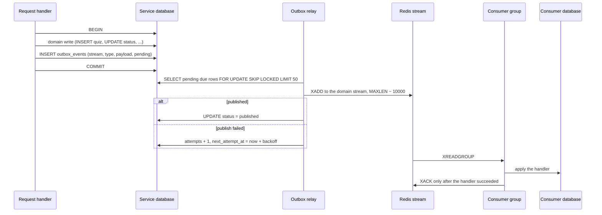
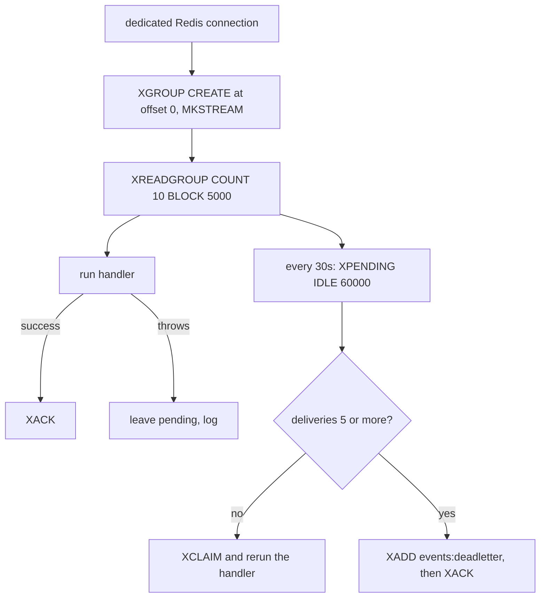

# Events and Async Processing

Everything asynchronous between services runs on Redis Streams, with a transactional outbox in front of it. This document is the authority on how an event gets from one service to another, and on what happens when that goes wrong.

## The full path



Two independent reliability mechanisms, one on each side.

## Producer side: the outbox

Every service that publishes has an identical `outbox_events` table:

```sql
id BIGSERIAL PRIMARY KEY,
stream TEXT NOT NULL,
type TEXT NOT NULL,
payload JSONB NOT NULL,
status TEXT NOT NULL DEFAULT 'pending',
attempts INTEGER NOT NULL DEFAULT 0,
next_attempt_at TIMESTAMPTZ NOT NULL DEFAULT NOW(),
published_at TIMESTAMPTZ,
last_error TEXT,
created_at TIMESTAMPTZ NOT NULL DEFAULT NOW()
```

with a partial index on `next_attempt_at WHERE status = 'pending'`.

The problem it solves: writing to the database and publishing to Redis are two systems, and there is no shared transaction. Publishing first can announce something that then fails to commit. Publishing after commit can lose the event if the process dies in between.

The fix is to make the event part of the same transaction. `enqueueOutboxEvent(client, type, payload)` takes the caller's transaction client, so the event row commits with the domain change or not at all.

The relay is a loop in every service process:

- Every `OUTBOX_RELAY_INTERVAL_MS` (1000ms), or immediately if the last batch was full.
- Claims up to `OUTBOX_RELAY_BATCH` (50) due pending rows with `FOR UPDATE SKIP LOCKED`, so multiple processes never publish the same row.
- Failure raises `attempts` and pushes `next_attempt_at` out by exponential backoff, 1s doubling to a 60s cap.

Rows are marked `published`, never deleted. Nothing prunes them, so `outbox_events` grows forever. Not a problem at this size; worth a cleanup job before it is.

The Exam **worker** also runs a relay, because auto-submit enqueues `session.submitted` events. `SKIP LOCKED` makes API and worker relays safe to run against the same table.

## Consumer side: groups, retry, dead letters

`config/eventConsumer.js` is duplicated verbatim in quiz, exam, analytics and questionbank.



The important details:

**A dedicated connection.** `XREADGROUP` blocks for five seconds at a time. Sharing the request-path client would stall revocation checks and cache reads behind that block.

**Groups start at `0`, not `$`.** A brand-new group replays everything still in the stream instead of skipping it. That is what makes a rebuild of a read-model possible.

**Ack only on success.** A throwing handler leaves the entry in the pending list. It is reclaimed after 60 seconds idle, up to 5 delivery attempts, then written to `events:deadletter` and acked so it stops blocking the group.

Those numbers are defaults, not constants. `CONSUMER_RECLAIM_IDLE_MS`, `CONSUMER_RECLAIM_INTERVAL_MS`, `CONSUMER_MAX_ATTEMPTS`, `CONSUMER_BLOCK_MS` and `CONSUMER_DEADLETTER_STREAM` override them. Nothing sets them in production; they exist so `tests/events/consumer.test.js` can watch a retry happen in under a second instead of a minute. See [Testing](./13_testing.md).

**Handlers must be idempotent.** Redelivery is normal, not exceptional. Every handler in the codebase is either an `ON CONFLICT` upsert or a state transition that no-ops when already applied.

Nothing consumes `events:deadletter`. It is an inspection queue: `XRANGE events:deadletter - +` to see what failed.

## Event catalog

| Event | Stream | Producer | Consumers | Payload |
|---|---|---|---|---|
| `teacher.upserted` | `events:auth` | auth | none today | id, name, email, school |
| `teacher.deleted` | `events:auth` | auth | questionbank, quiz | teacherId |
| `teacher_subjects.assigned` | `events:auth` | auth | questionbank, quiz | teacherId, subjectId |
| `teacher_subjects.removed` | `events:auth` | auth | questionbank, quiz | teacherId, subjectId |
| `subject.upserted` | `events:questionbank` | questionbank | quiz, exam worker, analytics | id, name, createdBy |
| `subject.deleted` | `events:questionbank` | questionbank | quiz, exam worker, analytics | id |
| `quiz.upserted` | `events:quiz` | quiz | exam worker, analytics | full quiz row |
| `quiz.snapshot` | `events:quiz` | quiz | exam worker | quizId, questions with answers |
| `quiz.ended` | `events:quiz` | quiz | exam worker | quizId |
| `quiz.deleted` | `events:quiz` | quiz | exam worker, analytics | quizId |
| `session.started` | `events:session` | exam api | analytics | session identity + startedAt |
| `session.submitted` | `events:session` | exam api, exam worker | analytics | sessionId, quizId, score, totalPoints |
| `violation.flagged` | `events:violation` | exam api | analytics | sessionId, quizId |
| `quiz.start_due` | `events:scheduler` | scheduler | quiz | quizId |
| `quiz.end_due` | `events:scheduler` | scheduler | quiz | quizId |
| `quiz.prewarm_due` | `events:scheduler` | scheduler | quiz | quizId |

`teacher.upserted` is published and nobody reads it. Harmless, but do not assume a downstream service knows a teacher's name.

The scheduler is the exception to the outbox rule: it has no database of its own and its signals are derived from a query, so it publishes straight to Redis with a `SET NX` dedup key instead. See [Scheduler](./7_scheduler.md).

## Consumer groups

| Stream | Group | Service |
|---|---|---|
| `events:auth` | `questionbank-teacher-subjects` | questionbank |
| `events:auth` | `quiz-teacher-subjects-projector` | quiz |
| `events:questionbank` | `quiz-subjects-projector` | quiz |
| `events:questionbank` | `questionbank-projection` | exam worker |
| `events:questionbank` | `analytics-subjects-projector` | analytics |
| `events:quiz` | `quiz-events` | exam worker |
| `events:quiz` | `analytics-quiz-projector` | analytics |
| `events:session` | `analytics-sessions-projector` | analytics |
| `events:violation` | `analytics-violations-projector` | analytics |
| `events:scheduler` | `quiz-scheduler-reactor` | quiz |

Separate groups per consumer means each service gets its own copy of every event and its own independent cursor.

## Redis, and what lives in it

One Redis instance, two roles.

**Event bus.** `events:*` streams. Not disposable. Bounded by `MAXLEN ~ 10000` at publish time, no TTL.

**Cache and coordination.** Disposable, always with a Postgres fallback:

| Key | Owner | Purpose | TTL |
|---|---|---|---|
| `revoked:<sha256>` | auth writes, all read | Logged-out token denylist | remaining token life |
| `rate_limit:<key>` | all | Fixed-window counters | the window |
| `quiz:<id>:student_snapshot` | exam | Student-safe questions | `QUIZ_SNAPSHOT_TTL_MS`, 4h |
| `quiz:<id>:live_stats:<teacher>` | exam | Live stats cache | 3s |
| `sched:<type>:<quizId>` | scheduler | Due-signal dedup | 15s, 60s for prewarm |

`docker/redis/redis.conf` is configured to keep those two roles from colliding:

- `maxmemory 256mb` with `maxmemory-policy volatile-lru`. Only keys with a TTL are eviction candidates, and streams carry no TTL, so cache pressure can never evict undelivered events.
- `appendonly yes` with `appendfsync everysec`, so a restart does not drop pending stream entries. The cache simply warms again.
- `timeout 0`. Closing idle connections every 300s caused ioredis reconnects that desynced command and response correlation, which showed up as spurious "token revoked" errors.

## Degradation without Redis

| Function | Without Redis |
|---|---|
| Event publishing | Rows accumulate in `outbox_events` and drain when it returns |
| Event consumption | Consumers idle and retry the connection |
| Token revocation | Non-auth services treat every token as valid |
| Rate limiting | Per-process in-memory counters |
| Student snapshot | Read from `quiz_snapshot` in Postgres |
| Live stats | Process-local TTL cache |
| Scheduler | Publishes nothing; no quiz starts or ends on schedule |

Nothing loses data. The scheduler is the one function that stops entirely.

## What is not implemented

- No consumer for `events:deadletter`, and no alert when something lands there.
- No pruning of published `outbox_events` rows.
- No metric or log for consumer lag.

## Related documentation

- [Architecture](./1_architecture.md)
- [Scheduler](./7_scheduler.md)
- [Analytics](./8_analytics.md)
- [Databases](./10_databases.md)
